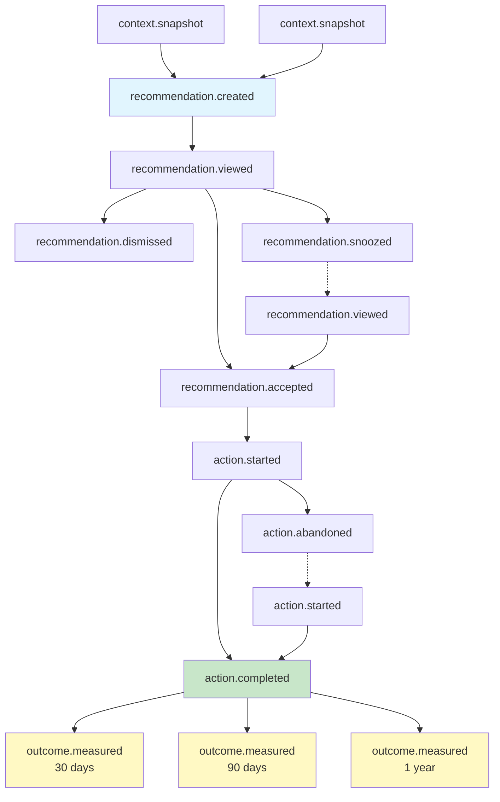

# Context Graph / Decision Trace Model

Version: 1.0.0
Last Updated: 2026-01-25

## Overview

The Context Graph is the core differentiator of the platform—it provides **explainable financial recommendations** by capturing the complete decision trace: inputs, rules, assumptions, and outcomes. This enables:

- **Transparency**: Users understand why recommendations were made
- **Reproducibility**: Decisions can be replayed for debugging and auditing
- **Learning**: Track which recommendations lead to positive outcomes
- **Compliance**: Full audit trail for regulatory requirements

All events are **scoped per app** (multi-tenant), ensuring complete data isolation.

---

## Event Types

### Event Type Enumeration

```typescript
type DecisionTraceEventType =
  // Recommendation lifecycle
  | 'recommendation.created'    // System generates a new recommendation
  | 'recommendation.viewed'     // User sees recommendation in UI
  | 'recommendation.accepted'   // User clicks "Do this" or similar
  | 'recommendation.dismissed'  // User dismisses/ignores
  | 'recommendation.snoozed'    // User defers to later

  // Action lifecycle
  | 'action.started'            // User begins acting on recommendation
  | 'action.completed'          // User completes the action
  | 'action.abandoned'          // User abandons mid-action

  // Outcome measurement
  | 'outcome.measured'          // System measures result (e.g., 30 days later)

  // Context capture
  | 'context.snapshot';         // Periodic capture of user's financial state
```

### Event Type Reference

| Event Type | When Emitted | Purpose | Key Payload Fields |
|------------|--------------|---------|-------------------|
| `recommendation.created` | System generates recommendation | Record inputs, rules, reasoning | `input_set`, `rules_applied`, `assumptions`, `result` |
| `recommendation.viewed` | User sees recommendation in UI | Track engagement | `view_duration_ms`, `view_context` |
| `recommendation.accepted` | User clicks "Do this" | Track conversion | `accepted_at`, `user_intent` |
| `recommendation.dismissed` | User dismisses recommendation | Track rejection for learning | `dismiss_reason`, `feedback` |
| `recommendation.snoozed` | User defers to later | Track deferral patterns | `snooze_until`, `snooze_count` |
| `action.started` | User begins acting | Track follow-through | `action_type`, `started_at` |
| `action.completed` | User completes action | Track completion | `completed_at`, `actual_amount` |
| `action.abandoned` | User abandons mid-action | Track drop-off points | `abandoned_at`, `abandon_reason`, `progress_percent` |
| `outcome.measured` | System measures result | Track actual impact | `measurement_date`, `metrics`, `baseline_comparison` |
| `context.snapshot` | Periodic state capture | Enable replay | `accounts`, `balances`, `goals`, `profile` |

---

## Event Schema

### Base Event Schema

All events share this base structure:

```typescript
interface DecisionTraceEvent<T extends EventPayload = EventPayload> {
  // Identity
  id: string;                      // UUID, globally unique
  trace_id: string;                // Groups related events (same recommendation journey)
  parent_event_id?: string;        // Causal link to triggering event

  // Classification
  event_type: DecisionTraceEventType;
  event_version: string;           // Semantic version, e.g., "1.0.0"

  // Multi-tenancy context (required for all events)
  app_id: string;                  // The app (tenant) this event belongs to
  user_id: string;                 // User within the app

  // Recommendation reference
  recommendation_id?: string;      // Links to specific recommendation (null for context.snapshot)

  // Timing
  timestamp: string;               // ISO 8601 with timezone
  processed_at?: string;           // When event was processed by system

  // Event-specific payload
  payload: T;

  // Metadata
  metadata?: {
    client_version?: string;       // App version that generated event
    platform?: string;             // ios, android, web
    session_id?: string;           // User session identifier
    request_id?: string;           // API request that triggered event
  };
}

// Base payload interface
interface EventPayload {
  [key: string]: unknown;
}
```

### SQL Schema for Event Storage

```sql
CREATE TABLE decision_trace_events (
  id UUID PRIMARY KEY,
  trace_id UUID NOT NULL,
  parent_event_id UUID REFERENCES decision_trace_events(id),

  event_type TEXT NOT NULL,
  event_version TEXT NOT NULL,

  -- Multi-tenancy
  app_id UUID NOT NULL REFERENCES apps(id) ON DELETE CASCADE,
  user_id UUID NOT NULL REFERENCES users(id) ON DELETE CASCADE,
  recommendation_id UUID,

  -- Timing
  timestamp TIMESTAMPTZ NOT NULL,
  processed_at TIMESTAMPTZ NOT NULL DEFAULT now(),

  -- Payload (JSONB for flexible querying)
  payload JSONB NOT NULL,
  metadata JSONB,

  -- Ensure app_id matches user's app
  CONSTRAINT fk_event_user_app FOREIGN KEY (app_id, user_id)
    REFERENCES users(app_id, id) ON DELETE CASCADE
);

-- Required indexes for query patterns
CREATE INDEX idx_events_trace ON decision_trace_events(trace_id, timestamp);
CREATE INDEX idx_events_user_type ON decision_trace_events(app_id, user_id, event_type, timestamp DESC);
CREATE INDEX idx_events_recommendation ON decision_trace_events(recommendation_id, timestamp)
  WHERE recommendation_id IS NOT NULL;
CREATE INDEX idx_events_type_time ON decision_trace_events(app_id, event_type, timestamp DESC);

-- GIN index for payload queries
CREATE INDEX idx_events_payload ON decision_trace_events USING GIN (payload jsonb_path_ops);

-- Partition by month for efficient archival (optional, for high-volume deployments)
-- CREATE TABLE decision_trace_events (...) PARTITION BY RANGE (timestamp);
```

---

## Recommendation Created Payload

The `recommendation.created` event captures the complete decision trace.

```typescript
interface RecommendationCreatedPayload extends EventPayload {
  // What was recommended
  recommendation_type: RecommendationType;
  title: string;                   // Human-readable title
  description: string;             // Explanation shown to user

  // Inputs used (snapshot at decision time)
  input_set: InputSet;

  // Rules/logic applied
  rules_applied: RuleApplication[];

  // Assumptions made
  assumptions: Assumption[];

  // Result
  result: RecommendationResult;

  // Provenance (data lineage)
  provenance: Provenance;
}

type RecommendationType =
  | 'emergency_fund_gap'
  | 'high_interest_debt_payoff'
  | 'debt_consolidation'
  | 'roth_vs_traditional'
  | 'tax_loss_harvesting'
  | 'rebalance_portfolio'
  | 'increase_contribution'
  | 'refinance_opportunity'
  | 'insurance_gap'
  | 'subscription_optimization'
  | 'custom';

interface InputSet {
  // Account state at decision time
  accounts_snapshot: AccountSnapshot[];

  // Financial profile
  income?: number;
  monthly_income?: number;
  expenses?: number;
  monthly_expenses?: number;

  // Goals and preferences
  goals?: Goal[];
  risk_tolerance?: 'conservative' | 'moderate' | 'aggressive';

  // Tax context
  tax_bracket?: number;
  filing_status?: 'single' | 'married_filing_jointly' | 'married_filing_separately' | 'head_of_household';
  state?: string;

  // Demographics
  age?: number;
  retirement_age?: number;

  // Custom inputs (extensible)
  [key: string]: unknown;
}

interface AccountSnapshot {
  id: string;                      // Platform account ID
  name: string;
  type: string;                    // checking, savings, credit, investment, etc.
  balance: number;
  interest_rate?: number;          // APR for debt accounts
  institution?: string;
}

interface Goal {
  type: string;                    // emergency_fund, retirement, debt_free, etc.
  target_amount?: number;
  target_months?: number;
  target_date?: string;
  priority?: 'high' | 'medium' | 'low';
}

interface RuleApplication {
  rule_id: string;                 // Unique rule identifier
  rule_version: string;            // Version of the rule logic
  rule_name?: string;              // Human-readable name
  parameters: Record<string, unknown>;
  condition_results: ConditionResult[];
  execution_time_ms?: number;      // How long rule took to execute
}

interface ConditionResult {
  condition: string;               // Human-readable condition
  expression?: string;             // Machine-readable expression
  passed: boolean;
  actual_value?: unknown;          // What the actual value was
  threshold_value?: unknown;       // What it was compared against
}

interface Assumption {
  key: string;                     // e.g., "inflation_rate", "growth_rate"
  value: unknown;
  source: 'user_input' | 'default' | 'calculated' | 'provider_data' | 'historical';
  confidence?: number;             // 0.0 - 1.0
  valid_until?: string;            // When this assumption expires
}

interface RecommendationResult {
  action: string;                  // What user should do (human-readable)
  action_type?: string;            // Machine-readable action category

  projected_impact: ProjectedImpact[];

  confidence: number;              // 0.0 - 1.0
  priority: 'high' | 'medium' | 'low';

  alternatives?: Alternative[];    // Other options considered
}

interface ProjectedImpact {
  metric: string;                  // e.g., "net_worth_1yr", "monthly_savings"
  current: number;
  projected: number;
  delta: number;
  timeframe?: string;              // e.g., "1_year", "5_years", "retirement"
  unit?: string;                   // e.g., "USD", "percent", "months"
}

interface Alternative {
  action: string;
  projected_impact: ProjectedImpact[];
  confidence: number;
  reason_not_recommended: string;
}

interface Provenance {
  data_freshness: DataFreshness[];
  model_version?: string;          // If ML model used
  rule_engine_version?: string;    // Version of rule engine
  random_seed?: number;            // For reproducibility of stochastic elements
}

interface DataFreshness {
  source: string;                  // Connection ID or data source
  last_synced_at: string;          // ISO 8601
  staleness_minutes?: number;      // How stale the data was at decision time
}
```

### Other Event Payloads

```typescript
interface RecommendationViewedPayload extends EventPayload {
  view_context: 'feed' | 'detail' | 'notification' | 'email';
  view_duration_ms?: number;
  scroll_depth_percent?: number;
  expanded_sections?: string[];
}

interface RecommendationAcceptedPayload extends EventPayload {
  accepted_at: string;
  user_intent?: string;            // Optional user comment
  commitment_amount?: number;      // If user specified an amount
  target_date?: string;            // If user set a target
}

interface RecommendationDismissedPayload extends EventPayload {
  dismiss_reason?: 'not_relevant' | 'already_doing' | 'cant_afford' | 'disagree' | 'other';
  feedback?: string;               // Optional user feedback
  will_reconsider?: boolean;
}

interface RecommendationSnoozedPayload extends EventPayload {
  snooze_until: string;            // ISO 8601
  snooze_count: number;            // How many times snoozed
  snooze_reason?: string;
}

interface ActionStartedPayload extends EventPayload {
  action_type: string;             // e.g., "transfer", "account_open", "contribution_change"
  started_at: string;
  initial_amount?: number;
  target_amount?: number;
}

interface ActionCompletedPayload extends EventPayload {
  completed_at: string;
  actual_amount: number;
  duration_minutes?: number;       // How long action took
  completion_method?: string;      // e.g., "in_app", "external", "automatic"
}

interface ActionAbandonedPayload extends EventPayload {
  abandoned_at: string;
  abandon_reason?: 'technical_error' | 'changed_mind' | 'insufficient_funds' | 'too_complex' | 'other';
  progress_percent: number;        // How far they got (0-100)
  last_step_completed?: string;
}

interface OutcomeMeasuredPayload extends EventPayload {
  measurement_date: string;
  measurement_type: 'scheduled' | 'triggered' | 'manual';
  days_since_action: number;

  metrics: MeasuredMetric[];

  baseline_comparison: {
    metric: string;
    baseline_value: number;        // Value at recommendation time
    current_value: number;
    change: number;
    change_percent: number;
  }[];

  recommendation_effective: boolean;  // Did it achieve the goal?
  effectiveness_score?: number;       // 0.0 - 1.0
}

interface MeasuredMetric {
  metric: string;
  value: number;
  projected_value: number;         // What was projected
  variance: number;                // actual - projected
  variance_percent: number;
}

interface ContextSnapshotPayload extends EventPayload {
  snapshot_type: 'scheduled' | 'pre_recommendation' | 'post_action' | 'manual';

  accounts: AccountSnapshot[];
  total_assets: number;
  total_liabilities: number;
  net_worth: number;

  goals: Goal[];
  profile: {
    income?: number;
    expenses?: number;
    savings_rate?: number;
    risk_tolerance?: string;
  };

  connections: {
    connection_id: string;
    provider: string;
    last_synced_at: string;
    status: string;
  }[];
}
```

---

## Causal Linking

### Event Flow Diagram

Events form a directed acyclic graph (DAG) representing the recommendation journey:



### Linking Semantics

| Field | Purpose | Example |
|-------|---------|---------|
| `trace_id` | Groups all events for one recommendation journey | All events from creation to outcome share same `trace_id` |
| `parent_event_id` | Direct causal link | `recommendation.viewed` → `recommendation.accepted` |
| `recommendation_id` | Reference to the recommendation entity | Same across all events for that recommendation |

### Trace Example

```
trace_id: "trace_efund_001"

Event 1: context.snapshot (id: evt_cs_001)
    └─► Event 2: recommendation.created (id: evt_rc_001, parent: evt_cs_001)
            └─► Event 3: recommendation.viewed (id: evt_rv_001, parent: evt_rc_001)
                    └─► Event 4: recommendation.accepted (id: evt_ra_001, parent: evt_rv_001)
                            └─► Event 5: action.started (id: evt_as_001, parent: evt_ra_001)
                                    └─► Event 6: action.completed (id: evt_ac_001, parent: evt_as_001)
                                            └─► Event 7: outcome.measured (id: evt_om_001, parent: evt_ac_001)
```

### Building the Causal Graph

```typescript
interface CausalGraph {
  trace_id: string;
  root_events: DecisionTraceEvent[];  // Events with no parent
  edges: Map<string, string[]>;       // parent_id -> child_ids
}

function buildCausalGraph(events: DecisionTraceEvent[]): CausalGraph {
  const edges = new Map<string, string[]>();
  const root_events: DecisionTraceEvent[] = [];

  for (const event of events) {
    if (!event.parent_event_id) {
      root_events.push(event);
    } else {
      const children = edges.get(event.parent_event_id) || [];
      children.push(event.id);
      edges.set(event.parent_event_id, children);
    }
  }

  return {
    trace_id: events[0]?.trace_id ?? '',
    root_events,
    edges,
  };
}

// Reconstruct full trace
async function getTraceEvents(traceId: string, appId: string): Promise<DecisionTraceEvent[]> {
  return db.query(`
    SELECT * FROM decision_trace_events
    WHERE trace_id = $1 AND app_id = $2
    ORDER BY timestamp ASC
  `, [traceId, appId]);
}
```

---

## Replay Semantics

### Requirements for Reproducibility

To reproduce any recommendation decision, the system must store sufficient information to re-run the exact same logic with the exact same inputs.

```typescript
interface ReplayContext {
  // The original event
  original_event: DecisionTraceEvent<RecommendationCreatedPayload>;

  // Everything needed to replay
  replay_inputs: {
    input_set: InputSet;           // Exact account state, profile, goals
    rules: RuleDefinition[];       // Exact rule versions used
    assumptions: Assumption[];     // All defaults and calculated values
    random_seed?: number;          // For stochastic elements
    timestamp: string;             // Decision timestamp (for time-sensitive rules)
  };
}

interface RuleDefinition {
  rule_id: string;
  rule_version: string;
  logic_hash: string;              // Hash of rule implementation
  parameters_schema: object;       // JSON Schema for parameters
}
```

### Replay Invariant

```typescript
// This test should ALWAYS pass for any recommendation
async function verifyReplayInvariant(event: DecisionTraceEvent<RecommendationCreatedPayload>): Promise<boolean> {
  const payload = event.payload;

  // Re-run the recommendation engine with stored inputs
  const replayed_result = await recommendationEngine.evaluate({
    input_set: payload.input_set,
    rules: payload.rules_applied.map(r => ({ id: r.rule_id, version: r.rule_version })),
    assumptions: payload.assumptions,
    random_seed: payload.provenance.random_seed,
    as_of_timestamp: event.timestamp,
  });

  // Results should match exactly
  return deepEqual(replayed_result, payload.result);
}
```

### What Must Be Stored

| Component | Required Fields | Purpose |
|-----------|-----------------|---------|
| **Input State** | All `accounts_snapshot`, `income`, `expenses`, `goals` | Exact financial state at decision time |
| **Rule Versions** | `rule_id`, `rule_version` for each rule | Exact logic that was applied |
| **Parameters** | `parameters` object for each rule | Configuration used |
| **Assumptions** | All `assumptions` with `source` | Defaults and calculated values |
| **Random Seed** | `provenance.random_seed` | Reproducibility of Monte Carlo simulations |
| **Timestamp** | `timestamp` | Time-sensitive rule evaluation |
| **Model Version** | `provenance.model_version` | ML model reproducibility |

### Replay API

```typescript
// POST /v1/recommendations/{id}/replay
interface ReplayRequest {
  // Optional overrides for what-if analysis
  override_inputs?: Partial<InputSet>;
  override_assumptions?: Partial<Record<string, unknown>>;
  as_of_timestamp?: string;        // Replay as if at different time
}

interface ReplayResponse {
  original_result: RecommendationResult;
  replayed_result: RecommendationResult;
  match: boolean;
  differences?: {
    field: string;
    original: unknown;
    replayed: unknown;
  }[];
}
```

---

## Sample Payloads

### 1. Emergency Fund Gap

```json
{
  "id": "evt_001",
  "trace_id": "trace_efund_001",
  "parent_event_id": null,
  "event_type": "recommendation.created",
  "event_version": "1.0.0",
  "app_id": "app_clearmoney",
  "user_id": "usr_sarah_123",
  "recommendation_id": "rec_efund_001",
  "timestamp": "2026-01-24T10:00:00Z",
  "payload": {
    "recommendation_type": "emergency_fund_gap",
    "title": "Build your emergency fund",
    "description": "You have 1.7 months of expenses saved. We recommend building to 3 months for financial security.",
    "input_set": {
      "accounts_snapshot": [
        {
          "id": "acc_chase_savings",
          "name": "Chase Savings",
          "type": "savings",
          "balance": 8500,
          "institution": "Chase"
        },
        {
          "id": "acc_chase_checking",
          "name": "Chase Checking",
          "type": "checking",
          "balance": 2500,
          "institution": "Chase"
        }
      ],
      "monthly_expenses": 5000,
      "monthly_income": 7500,
      "goals": [
        {
          "type": "emergency_fund",
          "target_months": 3,
          "priority": "high"
        }
      ]
    },
    "rules_applied": [
      {
        "rule_id": "emergency_fund_coverage",
        "rule_version": "1.2.0",
        "rule_name": "Emergency Fund Coverage Check",
        "parameters": {
          "target_months": 3,
          "include_checking": false
        },
        "condition_results": [
          {
            "condition": "current_months < target_months",
            "expression": "8500 / 5000 < 3",
            "passed": true,
            "actual_value": 1.7,
            "threshold_value": 3
          }
        ],
        "execution_time_ms": 2
      }
    ],
    "assumptions": [
      {
        "key": "monthly_expenses",
        "value": 5000,
        "source": "calculated",
        "confidence": 0.85
      },
      {
        "key": "emergency_fund_accounts",
        "value": ["acc_chase_savings"],
        "source": "user_input"
      }
    ],
    "result": {
      "action": "Save an additional $6,500 to reach 3 months of expenses ($15,000)",
      "action_type": "increase_savings",
      "projected_impact": [
        {
          "metric": "emergency_fund_months",
          "current": 1.7,
          "projected": 3.0,
          "delta": 1.3,
          "unit": "months"
        },
        {
          "metric": "financial_security_score",
          "current": 45,
          "projected": 72,
          "delta": 27,
          "unit": "points"
        }
      ],
      "confidence": 0.92,
      "priority": "high"
    },
    "provenance": {
      "data_freshness": [
        {
          "source": "conn_chase_001",
          "last_synced_at": "2026-01-24T09:55:00Z",
          "staleness_minutes": 5
        }
      ],
      "rule_engine_version": "2.1.0"
    }
  },
  "metadata": {
    "client_version": "1.5.0",
    "platform": "ios",
    "session_id": "sess_abc123"
  }
}
```

### 2. High-Interest Debt Payoff

```json
{
  "id": "evt_002",
  "trace_id": "trace_debt_001",
  "parent_event_id": null,
  "event_type": "recommendation.created",
  "event_version": "1.0.0",
  "app_id": "app_clearmoney",
  "user_id": "usr_sarah_123",
  "recommendation_id": "rec_debt_001",
  "timestamp": "2026-01-24T10:01:00Z",
  "payload": {
    "recommendation_type": "high_interest_debt_payoff",
    "title": "Pay off high-interest credit card",
    "description": "Your Amex card at 22% APR is costing you $110/month in interest. Paying it off saves $1,320/year.",
    "input_set": {
      "accounts_snapshot": [
        {
          "id": "acc_amex_cc",
          "name": "Amex Gold Card",
          "type": "credit",
          "balance": -6000,
          "interest_rate": 0.22,
          "institution": "American Express"
        },
        {
          "id": "acc_chase_savings",
          "name": "Chase Savings",
          "type": "savings",
          "balance": 8500,
          "institution": "Chase"
        }
      ],
      "monthly_income": 7500,
      "goals": [
        {
          "type": "debt_free",
          "priority": "high"
        }
      ]
    },
    "rules_applied": [
      {
        "rule_id": "high_interest_debt_priority",
        "rule_version": "1.1.0",
        "rule_name": "High Interest Debt Prioritization",
        "parameters": {
          "apr_threshold": 0.10,
          "min_savings_buffer_months": 1
        },
        "condition_results": [
          {
            "condition": "debt_apr > apr_threshold",
            "expression": "0.22 > 0.10",
            "passed": true,
            "actual_value": 0.22,
            "threshold_value": 0.10
          },
          {
            "condition": "has_sufficient_savings",
            "expression": "8500 > 6000 + (5000 * 1)",
            "passed": false,
            "actual_value": 8500,
            "threshold_value": 11000
          },
          {
            "condition": "interest_cost_significant",
            "expression": "(6000 * 0.22 / 12) > 50",
            "passed": true,
            "actual_value": 110,
            "threshold_value": 50
          }
        ],
        "execution_time_ms": 3
      }
    ],
    "assumptions": [
      {
        "key": "interest_rate_annual",
        "value": 0.22,
        "source": "provider_data"
      },
      {
        "key": "monthly_interest_cost",
        "value": 110,
        "source": "calculated"
      },
      {
        "key": "minimum_payment",
        "value": 150,
        "source": "calculated"
      }
    ],
    "result": {
      "action": "Pay off $6,000 Amex balance to eliminate $1,320/year in interest",
      "action_type": "debt_payoff",
      "projected_impact": [
        {
          "metric": "annual_interest_paid",
          "current": 1320,
          "projected": 0,
          "delta": -1320,
          "timeframe": "1_year",
          "unit": "USD"
        },
        {
          "metric": "net_worth_1yr",
          "current": 2500,
          "projected": 3820,
          "delta": 1320,
          "timeframe": "1_year",
          "unit": "USD"
        },
        {
          "metric": "debt_free_date",
          "current": 48,
          "projected": 0,
          "delta": -48,
          "unit": "months"
        }
      ],
      "confidence": 0.95,
      "priority": "high",
      "alternatives": [
        {
          "action": "Pay $500/month toward balance (debt-free in 14 months)",
          "projected_impact": [
            {
              "metric": "total_interest_paid",
              "current": 1320,
              "projected": 420,
              "delta": -900,
              "unit": "USD"
            }
          ],
          "confidence": 0.90,
          "reason_not_recommended": "Full payoff saves more in interest and improves credit utilization faster"
        }
      ]
    },
    "provenance": {
      "data_freshness": [
        {
          "source": "conn_amex_001",
          "last_synced_at": "2026-01-24T09:50:00Z",
          "staleness_minutes": 11
        },
        {
          "source": "conn_chase_001",
          "last_synced_at": "2026-01-24T09:55:00Z",
          "staleness_minutes": 6
        }
      ],
      "rule_engine_version": "2.1.0"
    }
  }
}
```

### 3. Roth vs Traditional 401(k)

```json
{
  "id": "evt_003",
  "trace_id": "trace_roth_001",
  "parent_event_id": null,
  "event_type": "recommendation.created",
  "event_version": "1.0.0",
  "app_id": "app_clearmoney",
  "user_id": "usr_sarah_123",
  "recommendation_id": "rec_roth_001",
  "timestamp": "2026-01-24T10:02:00Z",
  "payload": {
    "recommendation_type": "roth_vs_traditional",
    "title": "Consider Roth 401(k) contributions",
    "description": "Based on your income and expected retirement tax bracket, switching to Roth could save you $47,000 over 30 years.",
    "input_set": {
      "accounts_snapshot": [
        {
          "id": "acc_fidelity_401k",
          "name": "Fidelity 401(k)",
          "type": "401k",
          "balance": 85000,
          "institution": "Fidelity"
        }
      ],
      "income": 150000,
      "monthly_income": 12500,
      "age": 32,
      "retirement_age": 62,
      "state": "CA",
      "filing_status": "single",
      "tax_bracket": 0.32
    },
    "rules_applied": [
      {
        "rule_id": "roth_vs_traditional_optimizer",
        "rule_version": "2.0.0",
        "rule_name": "Roth vs Traditional Tax Optimization",
        "parameters": {
          "growth_rate": 0.07,
          "inflation_rate": 0.03,
          "current_federal_bracket": 0.32,
          "current_state_bracket": 0.093,
          "projected_retirement_federal_bracket": 0.24,
          "projected_retirement_state_bracket": 0.06,
          "years_to_retirement": 30,
          "annual_contribution": 23000
        },
        "condition_results": [
          {
            "condition": "roth_npv > traditional_npv",
            "expression": "roth_after_tax_value > traditional_after_tax_value",
            "passed": true,
            "actual_value": 1247000,
            "threshold_value": 1200000
          },
          {
            "condition": "tax_bracket_likely_lower_in_retirement",
            "passed": true,
            "actual_value": 0.24,
            "threshold_value": 0.32
          }
        ],
        "execution_time_ms": 45
      }
    ],
    "assumptions": [
      {
        "key": "growth_rate",
        "value": 0.07,
        "source": "default",
        "confidence": 0.7
      },
      {
        "key": "inflation_rate",
        "value": 0.03,
        "source": "default",
        "confidence": 0.8
      },
      {
        "key": "retirement_spending",
        "value": 80000,
        "source": "user_input"
      },
      {
        "key": "retirement_federal_bracket",
        "value": 0.24,
        "source": "calculated",
        "confidence": 0.65
      },
      {
        "key": "retirement_state_bracket",
        "value": 0.06,
        "source": "calculated",
        "confidence": 0.6
      },
      {
        "key": "social_security_income",
        "value": 30000,
        "source": "calculated"
      }
    ],
    "result": {
      "action": "Switch 401(k) contributions from Traditional to Roth",
      "action_type": "account_type_change",
      "projected_impact": [
        {
          "metric": "lifetime_tax_savings",
          "current": 0,
          "projected": 47000,
          "delta": 47000,
          "timeframe": "retirement",
          "unit": "USD"
        },
        {
          "metric": "retirement_after_tax_value",
          "current": 1200000,
          "projected": 1247000,
          "delta": 47000,
          "timeframe": "retirement",
          "unit": "USD"
        },
        {
          "metric": "tax_flexibility_score",
          "current": 30,
          "projected": 75,
          "delta": 45,
          "unit": "points"
        }
      ],
      "confidence": 0.78,
      "priority": "medium",
      "alternatives": [
        {
          "action": "Split contributions 50/50 between Roth and Traditional",
          "projected_impact": [
            {
              "metric": "lifetime_tax_savings",
              "current": 0,
              "projected": 23500,
              "delta": 23500,
              "unit": "USD"
            }
          ],
          "confidence": 0.82,
          "reason_not_recommended": "Full Roth provides better tax diversification at your income level"
        }
      ]
    },
    "provenance": {
      "data_freshness": [
        {
          "source": "conn_fidelity_001",
          "last_synced_at": "2026-01-24T09:45:00Z",
          "staleness_minutes": 17
        }
      ],
      "model_version": "roth_optimizer_v2.0",
      "rule_engine_version": "2.1.0",
      "random_seed": 42
    }
  }
}
```

---

## Schema Versioning

### Version Format

Use semantic versioning: `MAJOR.MINOR.PATCH`

| Version Component | When to Increment | Examples |
|-------------------|-------------------|----------|
| **MAJOR** | Breaking changes (field removal, type changes) | Removing `input_set`, changing `confidence` from number to object |
| **MINOR** | Additive changes (new optional fields) | Adding `alternatives` to result, new event type |
| **PATCH** | Bug fixes, documentation | Fixing typo in field description |

### Version Storage

```typescript
// Every event includes its schema version
interface DecisionTraceEvent {
  event_version: string;  // e.g., "1.2.0"
  // ...
}
```

### Backward Compatibility

```typescript
// Maintain readers for last 3 major versions
const EVENT_READERS: Record<string, EventReader> = {
  '1.x': readV1Event,
  '2.x': readV2Event,
  '3.x': readV3Event,  // Current
};

function readEvent(raw: unknown): DecisionTraceEvent {
  const version = (raw as any).event_version;
  const major = version.split('.')[0];
  const reader = EVENT_READERS[`${major}.x`];

  if (!reader) {
    throw new UnsupportedVersionError(`Event version ${version} not supported`);
  }

  return reader(raw);
}

// Migration helpers
function migrateV1ToV2(event: V1Event): V2Event {
  return {
    ...event,
    event_version: '2.0.0',
    // Add new required fields with defaults
    metadata: event.metadata || {},
  };
}
```

### Schema Changelog

Maintain a changelog at `docs/platform/event-schema-changelog.md`:

```markdown
# Event Schema Changelog

## [1.2.0] - 2026-01-25
### Added
- `alternatives` field in `RecommendationResult`
- `execution_time_ms` in `RuleApplication`

## [1.1.0] - 2026-01-20
### Added
- `metadata` field on base event
- `confidence` field in `Assumption`

## [1.0.0] - 2026-01-15
### Added
- Initial schema release
- All 10 event types
- Full recommendation.created payload
```

---

## Query Patterns

### 1. Trace Reconstruction

Get all events for a recommendation journey:

```sql
-- Get complete trace ordered by time
SELECT * FROM decision_trace_events
WHERE trace_id = $1 AND app_id = $2
ORDER BY timestamp ASC;

-- With causal graph structure
SELECT
  e.*,
  p.event_type AS parent_event_type
FROM decision_trace_events e
LEFT JOIN decision_trace_events p ON e.parent_event_id = p.id
WHERE e.trace_id = $1 AND e.app_id = $2
ORDER BY e.timestamp ASC;
```

### 2. User Recommendation History

```sql
-- Get all recommendations for a user with current status
SELECT
  e.recommendation_id,
  e.payload->>'title' AS title,
  e.payload->>'recommendation_type' AS type,
  e.payload->'result'->>'priority' AS priority,
  e.timestamp AS created_at,
  latest_status.event_type AS current_status,
  latest_status.timestamp AS status_updated_at
FROM decision_trace_events e
LEFT JOIN LATERAL (
  SELECT event_type, timestamp
  FROM decision_trace_events
  WHERE trace_id = e.trace_id AND app_id = e.app_id
    AND event_type IN ('recommendation.accepted', 'recommendation.dismissed',
                       'recommendation.snoozed', 'action.completed', 'outcome.measured')
  ORDER BY timestamp DESC
  LIMIT 1
) latest_status ON true
WHERE e.app_id = $1
  AND e.user_id = $2
  AND e.event_type = 'recommendation.created'
ORDER BY e.timestamp DESC
LIMIT 50;
```

### 3. Conversion Funnel Analysis

```sql
-- Count events by type for funnel analysis
SELECT
  event_type,
  COUNT(*) AS event_count,
  COUNT(DISTINCT trace_id) AS unique_traces,
  COUNT(DISTINCT user_id) AS unique_users
FROM decision_trace_events
WHERE app_id = $1
  AND timestamp >= $2
  AND timestamp < $3
GROUP BY event_type
ORDER BY
  CASE event_type
    WHEN 'recommendation.created' THEN 1
    WHEN 'recommendation.viewed' THEN 2
    WHEN 'recommendation.accepted' THEN 3
    WHEN 'action.started' THEN 4
    WHEN 'action.completed' THEN 5
    WHEN 'outcome.measured' THEN 6
    ELSE 99
  END;

-- Funnel conversion rates
WITH funnel AS (
  SELECT
    trace_id,
    MAX(CASE WHEN event_type = 'recommendation.created' THEN 1 ELSE 0 END) AS created,
    MAX(CASE WHEN event_type = 'recommendation.viewed' THEN 1 ELSE 0 END) AS viewed,
    MAX(CASE WHEN event_type = 'recommendation.accepted' THEN 1 ELSE 0 END) AS accepted,
    MAX(CASE WHEN event_type = 'action.completed' THEN 1 ELSE 0 END) AS completed
  FROM decision_trace_events
  WHERE app_id = $1 AND timestamp >= $2
  GROUP BY trace_id
)
SELECT
  SUM(created) AS total_created,
  SUM(viewed) AS total_viewed,
  SUM(accepted) AS total_accepted,
  SUM(completed) AS total_completed,
  ROUND(100.0 * SUM(viewed) / NULLIF(SUM(created), 0), 1) AS view_rate,
  ROUND(100.0 * SUM(accepted) / NULLIF(SUM(viewed), 0), 1) AS accept_rate,
  ROUND(100.0 * SUM(completed) / NULLIF(SUM(accepted), 0), 1) AS complete_rate
FROM funnel;
```

### 4. Rule Effectiveness Analysis

```sql
-- Join recommendations with outcomes to measure rule effectiveness
-- Uses jsonb_array_elements to unnest ALL rules (not just the first)
SELECT
  rule->>'rule_id' AS rule_id,
  rule->>'rule_version' AS rule_version,
  r.payload->>'recommendation_type' AS recommendation_type,
  COUNT(DISTINCT r.trace_id) AS total_recommendations,
  COUNT(DISTINCT o.trace_id) AS measured_outcomes,
  AVG((o.payload->>'effectiveness_score')::float) AS avg_effectiveness,
  COUNT(DISTINCT CASE WHEN (o.payload->>'recommendation_effective')::boolean THEN o.trace_id END) AS successful_outcomes
FROM decision_trace_events r,
  jsonb_array_elements(r.payload->'rules_applied') AS rule
LEFT JOIN decision_trace_events o ON r.trace_id = o.trace_id
  AND o.event_type = 'outcome.measured'
  AND o.app_id = r.app_id
WHERE r.app_id = $1
  AND r.event_type = 'recommendation.created'
  AND r.timestamp >= $2
GROUP BY
  rule->>'rule_id',
  rule->>'rule_version',
  r.payload->>'recommendation_type'
ORDER BY total_recommendations DESC;
```

### 5. Recommendation Type Performance

```sql
-- Performance metrics by recommendation type
-- Uses CTE for better performance (avoids correlated subqueries)
WITH trace_statuses AS (
  SELECT DISTINCT trace_id, event_type
  FROM decision_trace_events
  WHERE app_id = $1
    AND event_type IN ('recommendation.accepted', 'action.completed')
)
SELECT
  r.payload->>'recommendation_type' AS type,
  COUNT(*) AS total,
  COUNT(DISTINCT r.user_id) AS unique_users,
  AVG((r.payload->'result'->>'confidence')::float) AS avg_confidence,
  COUNT(DISTINCT accepted.trace_id) AS accepted_count,
  COUNT(DISTINCT completed.trace_id) AS completed_count
FROM decision_trace_events r
LEFT JOIN trace_statuses accepted
  ON r.trace_id = accepted.trace_id AND accepted.event_type = 'recommendation.accepted'
LEFT JOIN trace_statuses completed
  ON r.trace_id = completed.trace_id AND completed.event_type = 'action.completed'
WHERE r.app_id = $1
  AND r.event_type = 'recommendation.created'
  AND r.timestamp >= $2
GROUP BY r.payload->>'recommendation_type'
ORDER BY total DESC;
```

### Index Recommendations

```sql
-- Primary indexes (included in schema above)
CREATE INDEX idx_events_trace ON decision_trace_events(trace_id, timestamp);
CREATE INDEX idx_events_user_type ON decision_trace_events(app_id, user_id, event_type, timestamp DESC);
CREATE INDEX idx_events_recommendation ON decision_trace_events(recommendation_id, timestamp);
CREATE INDEX idx_events_type_time ON decision_trace_events(app_id, event_type, timestamp DESC);

-- Additional indexes for analytics queries
CREATE INDEX idx_events_rec_type ON decision_trace_events(app_id, (payload->>'recommendation_type'), timestamp DESC)
  WHERE event_type = 'recommendation.created';

-- Partial index for outcome analysis
CREATE INDEX idx_events_outcomes ON decision_trace_events(app_id, trace_id, timestamp)
  WHERE event_type = 'outcome.measured';
```

---

## Appendix: Quick Reference

### Event Flow
```
context.snapshot → recommendation.created → recommendation.viewed
                                               ↓
                              ┌────────────────┼────────────────┐
                              ↓                ↓                ↓
                         .accepted         .dismissed       .snoozed
                              ↓
                       action.started
                              ↓
                    ┌─────────┴─────────┐
                    ↓                   ↓
             action.completed    action.abandoned
                    ↓
             outcome.measured (30d, 90d, 1yr)
```

### Key Fields
- `trace_id`: Groups all events for one recommendation
- `parent_event_id`: Direct causal link
- `event_version`: Schema version (semver)
- `app_id`: Multi-tenant isolation (required)

### Replay Requirements
1. Store complete `input_set` snapshot
2. Record `rule_id` + `rule_version` for each rule
3. Store all `assumptions` with source
4. Include `random_seed` for stochastic elements
5. Preserve `timestamp` for time-sensitive rules
