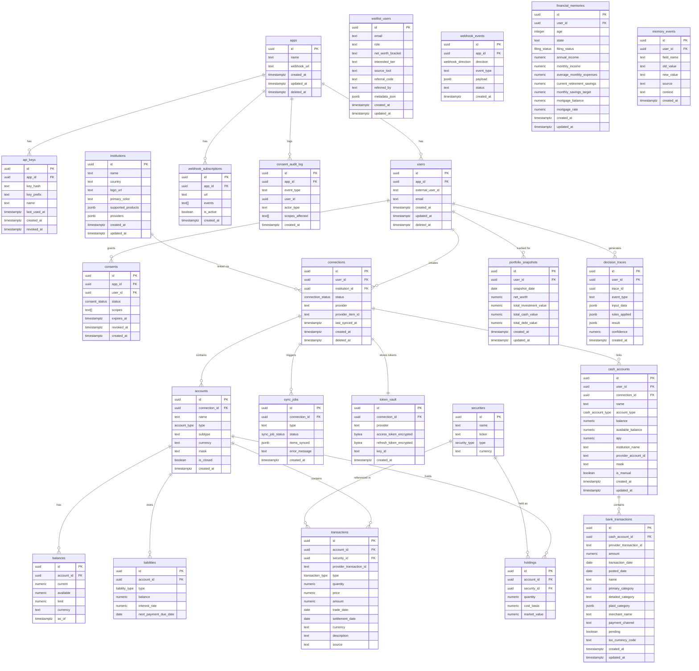
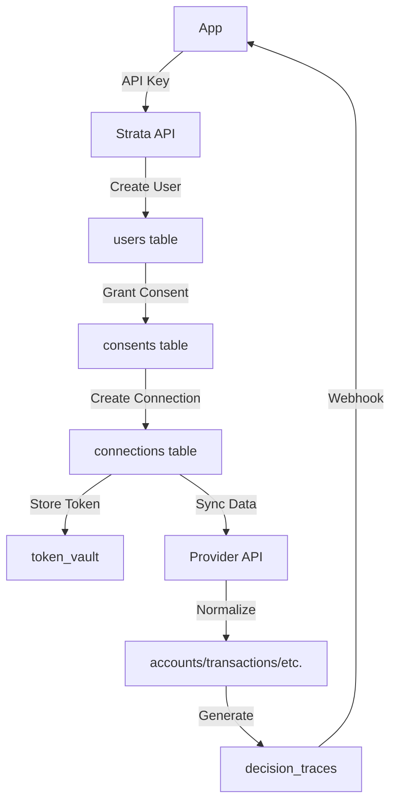

# Strata API - Data Model

Version: 1.1.0
Last Updated: 2026-02-05

## Overview

This document describes the data model for the Strata API, a multi-tenant financial connectivity platform. The model is designed to:

1. **Support multi-tenancy** — Apps are tenants with isolated user data
2. **Provide data provenance** — Track where data came from and how fresh it is
3. **Enable explainable AI** — Store decision traces for recommendation transparency
4. **Ensure security** — Encrypt sensitive tokens, hash API keys, maintain audit logs

## Multi-Tenancy Model

```
┌─────────────────────────────────────────────────────────────────────────┐
│                              PLATFORM                                    │
├─────────────────────────────────────────────────────────────────────────┤
│                                                                          │
│   ┌─────────────┐      ┌─────────────┐      ┌─────────────┐            │
│   │   App A     │      │   App B     │      │   App C     │            │
│   │ (ClearMoney)│      │ (Acme Fin)  │      │ (Beta App)  │            │
│   └──────┬──────┘      └──────┬──────┘      └──────┬──────┘            │
│          │                    │                    │                    │
│   ┌──────▼──────┐      ┌──────▼──────┐      ┌──────▼──────┐            │
│   │   Users     │      │   Users     │      │   Users     │            │
│   │ (isolated)  │      │ (isolated)  │      │ (isolated)  │            │
│   └──────┬──────┘      └──────┬──────┘      └──────┬──────┘            │
│          │                    │                    │                    │
│          ▼                    ▼                    ▼                    │
│   ┌─────────────────────────────────────────────────────────┐          │
│   │              Connections, Accounts, Data                 │          │
│   │                   (scoped per user)                      │          │
│   └─────────────────────────────────────────────────────────┘          │
│                                                                          │
│   ┌─────────────────────────────────────────────────────────┐          │
│   │                    Shared Data                           │          │
│   │              (Institutions, Securities)                  │          │
│   └─────────────────────────────────────────────────────────┘          │
│                                                                          │
└─────────────────────────────────────────────────────────────────────────┘
```

**Key Principles:**

- **Apps** are the root tenant entity
- **Users** belong to exactly one app (via `app_id` foreign key)
- The same `external_user_id` can exist in multiple apps (unique constraint is `(app_id, external_user_id)`)
- All user data (connections, accounts, transactions, etc.) is isolated per app
- **Institutions** and **Securities** are shared across all apps (reference data)

## Entity Relationship Diagram



## Table Descriptions

### Core Tables

#### `apps`
Registered tenant applications. Each app represents a consumer of the Strata API.

| Column | Type | Description |
|--------|------|-------------|
| `id` | UUID | Primary key |
| `name` | TEXT | Display name (e.g., "ClearMoney") |
| `webhook_url` | TEXT | Default webhook endpoint |
| `created_at` | TIMESTAMPTZ | Creation timestamp |
| `updated_at` | TIMESTAMPTZ | Last update timestamp |
| `deleted_at` | TIMESTAMPTZ | Soft delete timestamp |

#### `api_keys`
API keys for app authentication. Keys are hashed; only the prefix is stored in plain text.

| Column | Type | Description |
|--------|------|-------------|
| `id` | UUID | Primary key |
| `app_id` | UUID | FK to apps |
| `key_hash` | TEXT | SHA-256 hash of the API key |
| `key_prefix` | TEXT | First 8 chars for identification (e.g., "cgk_live") |
| `name` | TEXT | Optional friendly name |
| `last_used_at` | TIMESTAMPTZ | Last usage timestamp |
| `created_at` | TIMESTAMPTZ | Creation timestamp |
| `revoked_at` | TIMESTAMPTZ | Revocation timestamp (NULL = active) |

#### `users`
Platform users belonging to apps. The combination of `(app_id, external_user_id)` is unique.

| Column | Type | Description |
|--------|------|-------------|
| `id` | UUID | Platform-generated ID |
| `app_id` | UUID | FK to apps (tenant) |
| `external_user_id` | TEXT | App's identifier for this user |
| `email` | TEXT | Optional email |
| `created_at` | TIMESTAMPTZ | Creation timestamp |
| `updated_at` | TIMESTAMPTZ | Last update timestamp |
| `deleted_at` | TIMESTAMPTZ | Soft delete timestamp |

#### `waitlist_users`
Users who have joined the waitlist via mini-tools. Used for lead generation and hard signal collection.

| Column | Type | Description |
|--------|------|-------------|
| `id` | UUID | Primary key |
| `email` | TEXT | User email |
| `role` | TEXT | User role (e.g., "Founder") |
| `net_worth_bracket` | TEXT | Estimated net worth |
| `interested_tier` | TEXT | Preferred subscription tier |
| `source_tool` | TEXT | Tool used for signup |
| `referral_code` | TEXT | Unique code for referrals |
| `referred_by` | TEXT | Referrer's code |
| `metadata_json` | JSONB | Tool-specific calculation data |
| `created_at` | TIMESTAMPTZ | Creation timestamp |
| `updated_at` | TIMESTAMPTZ | Last update timestamp |

#### `institutions`
Financial institutions master list. **Shared across all apps.**

| Column | Type | Description |
|--------|------|-------------|
| `id` | UUID | Primary key |
| `name` | TEXT | Institution name |
| `country` | TEXT | Country code (default: "US") |
| `logo_url` | TEXT | Logo image URL |
| `primary_color` | TEXT | Brand color (hex) |
| `routing_numbers` | TEXT[] | Array of routing numbers |
| `supported_products` | JSONB | Supported data types |
| `providers` | JSONB | Provider-specific institution IDs |

#### `consents`
User consent records with granular scopes.

| Column | Type | Description |
|--------|------|-------------|
| `id` | UUID | Primary key |
| `app_id` | UUID | FK to apps (denormalized for queries) |
| `user_id` | UUID | FK to users |
| `status` | consent_status | 'active', 'revoked', 'expired' |
| `scopes` | TEXT[] | Granted scopes (e.g., ['accounts:read', 'transactions:read']) |
| `purpose` | TEXT | Human-readable purpose |
| `expires_at` | TIMESTAMPTZ | Expiration (NULL = no expiration) |
| `revoked_at` | TIMESTAMPTZ | Revocation timestamp |

#### `connections`
Links between users and financial institutions via a data provider.

| Column | Type | Description |
|--------|------|-------------|
| `id` | UUID | Primary key |
| `user_id` | UUID | FK to users |
| `institution_id` | UUID | FK to institutions |
| `status` | connection_status | Connection health status |
| `provider` | TEXT | Data provider (e.g., "plaid", "mx") |
| `provider_item_id` | TEXT | Provider's connection ID |
| `last_synced_at` | TIMESTAMPTZ | Last successful sync |
| `deleted_at` | TIMESTAMPTZ | Soft delete timestamp |

### Financial Data Tables

#### `accounts`
Financial accounts linked via connections.

| Column | Type | Description |
|--------|------|-------------|
| `id` | UUID | Primary key |
| `connection_id` | UUID | FK to connections |
| `name` | TEXT | Account name |
| `type` | account_type | Account type enum |
| `subtype` | TEXT | Provider-specific subtype |
| `currency` | TEXT | Currency code (default: "USD") |
| `mask` | TEXT | Last 4 digits |
| `is_closed` | BOOLEAN | Whether account is closed |

#### `balances`
Point-in-time balance snapshots. New row created on each sync.

| Column | Type | Description |
|--------|------|-------------|
| `id` | UUID | Primary key |
| `account_id` | UUID | FK to accounts |
| `current` | NUMERIC(19,4) | Current balance |
| `available` | NUMERIC(19,4) | Available balance |
| `limit` | NUMERIC(19,4) | Credit limit (for credit accounts) |
| `currency` | TEXT | Currency code |
| `as_of` | TIMESTAMPTZ | When balance was accurate |

#### `transactions`
Investment transaction records synced from brokerage accounts. Each transaction is uniquely identified by the combination of `(account_id, provider_transaction_id)`.

| Column | Type | Description |
|--------|------|-------------|
| `id` | UUID | Primary key |
| `account_id` | UUID | FK to investment accounts |
| `security_id` | UUID | FK to securities (nullable) |
| `provider_transaction_id` | TEXT | Provider's transaction identifier |
| `type` | transaction_type | Transaction type enum (see below) |
| `quantity` | NUMERIC(18,8) | Number of shares/units |
| `price` | NUMERIC(14,4) | Price per share at execution |
| `amount` | NUMERIC(14,2) | Total transaction amount |
| `trade_date` | DATE | Date the trade was executed |
| `settlement_date` | DATE | Date the trade settled |
| `currency` | TEXT | Currency code (default: "USD") |
| `description` | TEXT | Transaction description |
| `source` | TEXT | Data source (e.g., "snaptrade") |

#### `portfolio_snapshots`
Daily point-in-time portfolio snapshots per user. One snapshot per user per day, created by the background snapshot job. Used to drive the portfolio history chart.

| Column | Type | Description |
|--------|------|-------------|
| `id` | UUID | Primary key |
| `user_id` | UUID | FK to users |
| `snapshot_date` | DATE | Date of the snapshot (unique per user) |
| `net_worth` | NUMERIC(14,2) | Net worth (investment + cash - debt) |
| `total_investment_value` | NUMERIC(14,2) | Total investment account balances |
| `total_cash_value` | NUMERIC(14,2) | Total cash account balances |
| `total_debt_value` | NUMERIC(14,2) | Total debt account balances |
| `created_at` | TIMESTAMPTZ | Creation timestamp |
| `updated_at` | TIMESTAMPTZ | Last update timestamp |

#### `securities`
Security master data (stocks, funds, etc.). **Shared across all apps.**

| Column | Type | Description |
|--------|------|-------------|
| `id` | UUID | Primary key |
| `name` | TEXT | Security name |
| `ticker` | TEXT | Stock ticker symbol |
| `type` | security_type | Security type enum |
| `currency` | TEXT | Currency code |
| `cusip` | TEXT | CUSIP identifier |
| `isin` | TEXT | ISIN identifier |
| `close_price` | NUMERIC(19,4) | Last closing price |

#### `holdings`
Investment holdings linking accounts to securities.

| Column | Type | Description |
|--------|------|-------------|
| `id` | UUID | Primary key |
| `account_id` | UUID | FK to accounts |
| `security_id` | UUID | FK to securities |
| `quantity` | NUMERIC(19,8) | Number of shares/units |
| `cost_basis` | NUMERIC(19,4) | Total cost basis |
| `market_value` | NUMERIC(19,4) | Current market value |

#### `liabilities`
Detailed liability information for loans and credit accounts.

| Column | Type | Description |
|--------|------|-------------|
| `id` | UUID | Primary key |
| `account_id` | UUID | FK to accounts |
| `type` | liability_type | Liability type enum |
| `balance` | NUMERIC(19,4) | Outstanding balance |
| `interest_rate` | NUMERIC(7,4) | Interest rate as decimal |
| `next_payment_due_date` | DATE | Next payment date |
| `next_payment_amount` | NUMERIC(19,4) | Next payment amount |

#### `cash_accounts`
Cash, checking, savings, and money market accounts. Can be manually created or linked via Plaid.

| Column | Type | Description |
|--------|------|-------------|
| `id` | UUID | Primary key |
| `user_id` | UUID | FK to users |
| `connection_id` | UUID | FK to connections (NULL for manual accounts) |
| `name` | TEXT | Account name |
| `account_type` | cash_account_type | Account type enum |
| `balance` | NUMERIC(14,2) | Current balance |
| `available_balance` | NUMERIC(14,2) | Available balance (from provider) |
| `apy` | NUMERIC(6,4) | Annual percentage yield |
| `institution_name` | TEXT | Name of financial institution |
| `provider_account_id` | TEXT | Provider's account ID (for linked accounts) |
| `mask` | TEXT | Last 4 digits of account number |
| `is_manual` | BOOLEAN | True if manually created, false if linked via provider |

#### `bank_transactions`
Bank transaction history from linked Plaid accounts. Includes Plaid's automatic categorization.

| Column | Type | Description |
|--------|------|-------------|
| `id` | UUID | Primary key |
| `cash_account_id` | UUID | FK to cash_accounts |
| `provider_transaction_id` | TEXT | Provider's transaction ID (unique with cash_account_id) |
| `amount` | NUMERIC(14,2) | Transaction amount (negative=debit, positive=credit) |
| `transaction_date` | DATE | Date of transaction |
| `posted_date` | DATE | Date transaction posted (may differ from transaction_date) |
| `name` | TEXT | Transaction description |
| `primary_category` | TEXT | Plaid primary category (e.g., "FOOD_AND_DRINK") |
| `detailed_category` | TEXT | Plaid detailed category (e.g., "RESTAURANTS") |
| `plaid_category` | JSONB | Raw Plaid category array |
| `merchant_name` | TEXT | Cleaned merchant name |
| `payment_channel` | TEXT | Payment method ("online", "in_store", "other") |
| `pending` | BOOLEAN | Whether transaction is pending |
| `iso_currency_code` | TEXT | Currency code (default: "USD") |

#### `financial_memories`
User-specific financial profile and goals, serving as the "long-term memory" for the AI Advisor. Can be updated by the user or derived from connected accounts.

| Column | Type | Description |
|--------|------|-------------|
| `id` | UUID | Primary key |
| `user_id` | UUID | FK to users |
| `age` | INTEGER | User's age |
| `state` | TEXT | State of residence (2-letter code) |
| `filing_status` | filing_status | Tax filing status |
| `annual_income` | NUMERIC(14,2) | Total annual income |
| `monthly_income` | NUMERIC(14,2) | Average monthly income |
| `average_monthly_expenses` | NUMERIC(14,2) | Average monthly expenses (derived or manual) |
| `current_retirement_savings` | NUMERIC(14,2) | Total retirement savings |
| `monthly_savings_target` | NUMERIC(14,2) | Target monthly savings amount |
| `mortgage_balance` | NUMERIC(14,2) | Outstanding mortgage balance (derived) |
| `mortgage_rate` | NUMERIC(6,4) | Weighted average mortgage rate (derived) |
| `investment_horizon_years` | INTEGER | Investment time horizon |
| `risk_tolerance` | risk_tolerance | Risk profile enum |

### Operational Tables

#### `sync_jobs`
Tracks background data sync jobs.

| Column | Type | Description |
|--------|------|-------------|
| `id` | UUID | Primary key |
| `connection_id` | UUID | FK to connections |
| `type` | TEXT | 'scheduled', 'on_demand', 'webhook_triggered' |
| `data_types` | TEXT[] | Data types to sync |
| `status` | sync_job_status | Job status enum |
| `priority` | INTEGER | Priority (1=highest, 10=lowest) |
| `items_synced` | JSONB | Sync results |
| `error_message` | TEXT | Error details if failed |

#### `memory_events`
Audit log of changes to the `financial_memories` profile. Tracks who changed what and why (e.g., "User updated age" or "System derived mortgage balance").

| Column | Type | Description |
|--------|------|-------------|
| `id` | UUID | Primary key |
| `user_id` | UUID | FK to users |
| `field_name` | TEXT | The field that changed (e.g., "age") |
| `old_value` | TEXT | Previous value |
| `new_value` | TEXT | New value |
| `source` | TEXT | Source of change: 'user_input', 'calculator', 'account_sync', 'agent' |
| `context` | TEXT | Optional context or reason for the change |
| `created_at` | TIMESTAMPTZ | Timestamp of the event |

#### `webhook_subscriptions`
App webhook subscriptions for outbound events.

| Column | Type | Description |
|--------|------|-------------|
| `id` | UUID | Primary key |
| `app_id` | UUID | FK to apps |
| `url` | TEXT | Webhook endpoint URL |
| `events` | TEXT[] | Subscribed event types |
| `secret_hash` | TEXT | Hashed signing secret |
| `is_active` | BOOLEAN | Whether subscription is active |

#### `webhook_events`
Log of inbound and outbound webhook events.

| Column | Type | Description |
|--------|------|-------------|
| `id` | UUID | Primary key |
| `app_id` | UUID | FK to apps (NULL for inbound) |
| `direction` | webhook_direction | 'inbound' or 'outbound' |
| `event_type` | TEXT | Event type |
| `payload` | JSONB | Event payload |
| `status` | TEXT | Delivery status |

#### `decision_traces`
Event log for explainable AI recommendations (Strata).

| Column | Type | Description |
|--------|------|-------------|
| `id` | UUID | Primary key |
| `user_id` | UUID | FK to users |
| `trace_id` | UUID | Groups related events |
| `event_type` | TEXT | Event type |
| `input_data` | JSONB | Inputs used for decision |
| `rules_applied` | JSONB | Rules/logic applied |
| `result` | JSONB | Decision result |
| `confidence` | NUMERIC(3,2) | Confidence score (0-1) |

#### `consent_audit_log`
Immutable audit log for consent-related events. Retained for 7 years.

| Column | Type | Description |
|--------|------|-------------|
| `id` | UUID | Primary key |
| `app_id` | UUID | FK to apps |
| `event_type` | TEXT | Event type |
| `user_id` | UUID | Affected user |
| `scopes_affected` | TEXT[] | Scopes involved |
| `actor_type` | TEXT | 'user', 'system', 'admin', 'app' |

#### `token_vault`
Encrypted storage for provider OAuth tokens. Access restricted to token service.

| Column | Type | Description |
|--------|------|-------------|
| `id` | UUID | Primary key |
| `connection_id` | UUID | FK to connections |
| `provider` | TEXT | Provider name |
| `access_token_encrypted` | BYTEA | Encrypted access token |
| `refresh_token_encrypted` | BYTEA | Encrypted refresh token |
| `key_id` | TEXT | KMS key ID for encryption |

## Enum Types

### `connection_status`
```sql
'pending' | 'active' | 'degraded' | 'error' | 'disconnected' | 'revoked'
```

### `account_type`
```sql
'checking' | 'savings' | 'money_market' | 'cd' | 'investment' | 'brokerage' |
'401k' | 'ira' | 'credit' | 'loan' | 'mortgage' | 'other'
```

### `cash_account_type`
```sql
'checking' | 'savings' | 'money_market' | 'cd' | 'other'
```

### `transaction_type`
```sql
'buy' | 'sell' | 'dividend' | 'interest' | 'fee' | 'transfer' | 'other'
```

### `consent_status`
```sql
'active' | 'revoked' | 'expired'
```

### `sync_job_status`
```sql
'pending' | 'running' | 'completed' | 'failed' | 'cancelled' | 'retrying'
```

### `liability_type`
```sql
'credit_card' | 'mortgage' | 'student_loan' | 'auto_loan' | 'personal_loan' | 'heloc' | 'other'
```

### `security_type`
```sql
'stock' | 'bond' | 'mutual_fund' | 'etf' | 'option' | 'crypto' | 'other'
```

### `sync_status`
```sql
'synced' | 'syncing' | 'stale' | 'error'
```

## Provenance Fields

Financial data tables that are sourced from external providers include provenance fields to track data origin and freshness. These fields are present on: `users`, `consents`, `connections`, `accounts`, `balances`, `transactions`, `holdings`, `securities`, and `liabilities`.

**Note:** Operational tables (`apps`, `api_keys`, `sync_jobs`, `webhook_subscriptions`, `webhook_events`, `consent_audit_log`, `token_vault`) and master data tables (`institutions`) do not include provenance fields.

| Field | Type | Description |
|-------|------|-------------|
| `provider` | TEXT | Which aggregator sourced the data (e.g., "plaid", "mx") |
| `provider_item_id` | TEXT | Provider's connection/item identifier |
| `provider_account_id` | TEXT | Provider's account identifier |
| `last_refreshed_at` | TIMESTAMPTZ | When data was last fetched from provider |
| `confidence` | NUMERIC(3,2) | Data quality score (0.0 to 1.0) |
| `sync_status` | sync_status | Current sync state |

## Indexes

### Multi-Tenancy Indexes
```sql
-- Unique constraint for user scoping
CREATE UNIQUE INDEX idx_users_app_external ON users(app_id, external_user_id)
    WHERE deleted_at IS NULL;

-- Fast lookups by app
CREATE INDEX idx_users_app_id ON users(app_id) WHERE deleted_at IS NULL;
CREATE INDEX idx_api_keys_app_id ON api_keys(app_id) WHERE revoked_at IS NULL;
CREATE INDEX idx_consents_app_user ON consents(app_id, user_id) WHERE status = 'active';
```

### Hot Path Query Indexes
```sql
-- Connection lookups
CREATE INDEX idx_connections_user_id ON connections(user_id) WHERE deleted_at IS NULL;

-- Transaction queries (most common)
CREATE INDEX idx_transactions_account_id_date ON transactions(account_id, date DESC);
CREATE INDEX idx_transactions_date ON transactions(date DESC);

-- Balance history
CREATE INDEX idx_balances_account_id_as_of ON balances(account_id, as_of DESC);

-- Portfolio snapshot history
CREATE UNIQUE INDEX idx_snapshots_user_date ON portfolio_snapshots(user_id, snapshot_date);

-- Sync job processing
CREATE INDEX idx_sync_jobs_pending ON sync_jobs(priority, created_at)
    WHERE status IN ('pending', 'retrying');
```

## Soft Delete Pattern

Tables with soft delete (`deleted_at` column):
- `apps`
- `users`
- `connections`
- `accounts`

**Pattern:**
- `deleted_at` is NULL for active records
- Partial indexes exclude deleted records: `WHERE deleted_at IS NULL`
- Application queries should always filter by `deleted_at IS NULL`

## Security Considerations

### API Key Storage
- API keys are never stored in plain text
- Only the SHA-256 hash is stored for comparison
- Key prefix (first 8 chars) stored for identification in logs/UI

### Token Vault
- Provider OAuth tokens encrypted using AES-256-GCM
- Encryption keys managed by AWS KMS (or similar)
- Access restricted to token service role only
- Key rotation supported via `key_id` field

### Audit Logging
- `consent_audit_log` is append-only (no UPDATE or DELETE)
- All consent changes logged with actor, timestamp, and context
- Retained for 7 years per regulatory requirements

## Data Flow



## Related Documents

- [OpenAPI Specification](./openapi.yaml) — API contract
- [Consent and Vault Design](./consent-and-vault.md) — Security architecture
- [Sync and Freshness](./sync-and-freshness.md) — Data freshness model
- [Strata Events](./strata-events.md) — Decision trace schema
