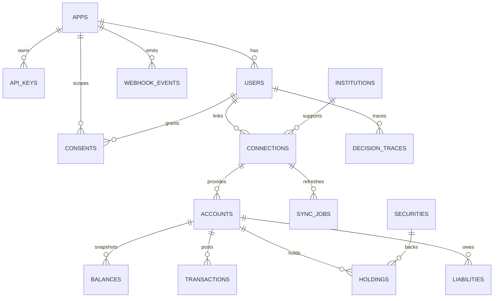

# Context Graph Data Model

## Overview
The Context Graph is a multi-tenant financial connectivity data model. Each **app** represents a tenant, and all end-user data is scoped to a single app via the `users.app_id` foreign key. This ensures isolation across tenants while allowing shared master data for financial institutions and securities.

### Multi-tenancy model
- **Apps** are the root tenant entity.
- **Users** belong to a single app (`users.app_id`).
- **App-scoped data** (consents, connections, accounts, transactions, holdings, balances, liabilities, decision traces, webhook events, and sync jobs) is tied to a user or an app and must be queried with the app boundary in mind.
- **Shared master data** includes institutions and securities, which are referenced by app-scoped records but not duplicated per tenant.

### Provenance fields
All data tables include provenance metadata:
- `provider`: aggregator that sourced the data.
- `provider_*_id`: provider’s identifier for the entity.
- `last_refreshed_at`: when the record was last fetched.
- `data_quality_score`: confidence score (0.0–1.0).

## Entity descriptions

### apps
Registered client applications (tenants). Apps own API keys and user records.

### api_keys
API key management for apps. Includes hashed keys, a human-friendly prefix, and revocation metadata.

### users
End-users scoped to an app. `external_user_id` is unique per app. User data is soft-deleted via `deleted_at`.

### consents
User consent records with granular scopes and lifecycle fields. Includes `app_id` for tenant-level filtering.

### institutions
Master list of financial institutions shared across apps. Includes routing numbers, supported products, and provider coverage.

### connections
Links a user to a financial institution and a provider item. Tracks connection status, errors, and sync timing. Soft-deleted.

### accounts
Provider-backed financial accounts linked to a connection. Tracks account type, subtype, currency, and closure state. Soft-deleted.

### balances
Point-in-time balance snapshots for accounts. Immutable historical rows.

### transactions
Normalized transactions for accounts, keyed by provider transaction ID. Includes description, merchant name, category array, and pending state.

### securities
Shared master data for securities (stocks, funds, etc.). Includes ticker, identifiers (CUSIP/ISIN), and pricing snapshots.

### holdings
Account-level investment holdings linked to a security and timestamped with `as_of`.

### liabilities
Account-level liability details (loans, credit, mortgages) with rate and payment metadata.

### sync_jobs
Background sync job tracking for connection refreshes and data ingestion runs.

### webhook_events
Log of inbound/outbound webhook traffic. Outbound events are scoped to `app_id`.

### decision_traces
Context graph events for user-level decisions. Supports parent-child traces, rules applied, and confidence scoring.

## Relationships and cardinality
- **apps 1—N users**: each app has many users; each user belongs to one app.
- **apps 1—N api_keys**: each app owns many API keys.
- **apps 1—N consents**: consent records are tenant-scoped via app/user.
- **users 1—N connections**: a user can have many connections.
- **institutions 1—N connections**: each connection references one institution.
- **connections 1—N accounts**: each connection can yield many accounts.
- **accounts 1—N balances**: multiple snapshots per account.
- **accounts 1—N transactions**: transactions belong to a single account.
- **accounts 1—N holdings** and **securities 1—N holdings**: holdings join accounts to securities.
- **accounts 1—N liabilities**: liabilities are tied to an account.
- **connections 1—N sync_jobs**: sync jobs track refreshes per connection.
- **apps 1—N webhook_events**: outbound webhooks belong to a specific app.
- **users 1—N decision_traces**: decision traces are per user.

## Mermaid ER diagram

## Notes on tenant isolation
- All reads and writes must be scoped by `app_id` through the user or app foreign keys.
- Shared master data (institutions, securities) must never include app-specific attributes.
- Soft-deleted rows (`deleted_at`) must be excluded from operational queries and indexes.
