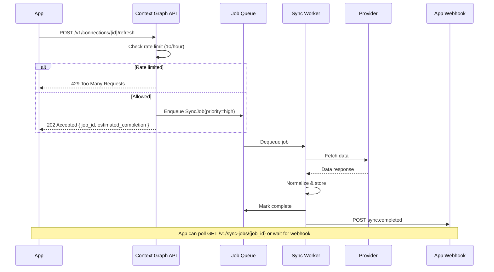
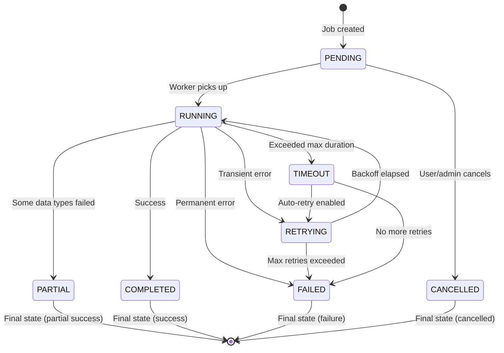

# Sync + Freshness Specification

This document defines the data synchronization system and freshness scoring model for the Context Graph platform. It covers sync cadence, job lifecycle, retry policies, staleness thresholds, and confidence scoring.

---

## Table of Contents

1. [Overview](#overview)
2. [Sync Cadence by Data Type](#sync-cadence-by-data-type)
3. [On-Demand Refresh Flow](#on-demand-refresh-flow)
4. [Sync Job State Machine](#sync-job-state-machine)
5. [Backoff and Retry Rules](#backoff-and-retry-rules)
6. [Staleness Thresholds](#staleness-thresholds)
7. [Confidence Score Model](#confidence-score-model)
8. [API Freshness Exposure](#api-freshness-exposure)
9. [UI Freshness Indicators](#ui-freshness-indicators)
10. [Sync Job Schema](#sync-job-schema)
11. [Error States and Recovery](#error-states-and-recovery)
12. [Webhook Events](#webhook-events)
13. [Monitoring and Alerting](#monitoring-and-alerting)

---

## Overview

The sync system is responsible for keeping user financial data current across all connected accounts. It balances data freshness against provider rate limits, cost, and system load.

### Design Principles

1. **Freshness over completeness**: Recent partial data is more valuable than stale complete data
2. **User-triggered > scheduled**: Prioritize on-demand refreshes over background syncs
3. **Graceful degradation**: Show stale data with warnings rather than blocking the user
4. **Provider-aware**: Respect each provider's rate limits and optimal sync patterns
5. **Multi-tenant isolation**: Sync jobs are scoped per app; one app's load doesn't affect another

---

## Sync Cadence by Data Type

Different data types have different volatility and user impact, requiring different sync frequencies.

| Data Type | Default Cadence | Trigger | Rationale |
|-----------|-----------------|---------|-----------|
| **Balances** | Every 4 hours | Scheduled + webhook | Changes frequently; critical for recommendations |
| **Transactions** | Daily at 6 AM user's timezone | Scheduled | New transactions appear overnight after processing |
| **Holdings** | Daily at 7 AM user's timezone | Scheduled | Market close + T+1 settlement timing |
| **Liabilities** | Weekly (Sundays at 2 AM) | Scheduled | Changes infrequently; statements monthly |
| **Account metadata** | On connection + weekly | On-demand | Rarely changes after initial setup |
| **Institution status** | Every 15 minutes | Platform-wide cron | Detect provider outages quickly |

### Timezone Handling

```typescript
function getNextDailySync(now: DateTime, hour: number): DateTime {
  const scheduled = now.set({ hour, minute: 0, second: 0, millisecond: 0 });
  return scheduled <= now ? scheduled.plus({ days: 1 }) : scheduled;
}

function getNextWeeklySync(now: DateTime, weekday: number, hour: number): DateTime {
  const scheduled = now.set({ weekday, hour, minute: 0, second: 0, millisecond: 0 });
  return scheduled <= now ? scheduled.plus({ weeks: 1 }) : scheduled;
}

function getNextScheduledSync(dataType: DataType, userTimezone: string): Date {
  const now = DateTime.now().setZone(userTimezone);

  switch (dataType) {
    case 'transactions':
      return getNextDailySync(now, 6).toJSDate();
    case 'holdings':
      return getNextDailySync(now, 7).toJSDate();
    case 'liabilities':
      return getNextWeeklySync(now, 7, 2).toJSDate();
    case 'balances':
    default:
      return now.plus({ hours: 4 }).toJSDate();
  }
}
```

### Provider-Specific Overrides

Some providers have optimal sync windows or restrictions:

| Provider | Override | Reason |
|----------|----------|--------|
| Plaid | Use `/transactions/sync` cursor | Incremental sync more efficient |
| MX | Avoid 2-4 AM UTC | Scheduled maintenance window |
| Finicity | Max 6 syncs/day per connection | Rate limit agreement |
| FDX | Real-time webhooks preferred | Native event support |

---

## On-Demand Refresh Flow

Users or apps can trigger immediate data refresh via the API.

### Flow Diagram



### API Request/Response

**Request:**
```http
POST /v1/connections/conn_abc123/refresh
Content-Type: application/json
X-API-Key: app_key_xxx

{
  "data_types": ["balances", "transactions"],  // Optional; defaults to all
  "force": false                                // Skip freshness check
}
```

**Response (202 Accepted):**
```json
{
  "job_id": "sync_job_xyz789",
  "status": "pending",
  "data_types": ["balances", "transactions"],
  "estimated_completion": "2026-01-24T10:30:45Z",
  "position_in_queue": 3
}
```

**Response (429 Rate Limited):**
```json
{
  "error": {
    "code": 429,
    "message": "Rate limit exceeded. Max 10 refreshes per connection per hour.",
    "type": "rate_limit",
    "retry_after": 1800,
    "request_id": "req_abc123"
  }
}
```

### Rate Limiting

| Limit Type | Value | Scope |
|------------|-------|-------|
| Per-connection refresh | 10/hour | Single connection |
| Per-user refresh | 50/hour | All user's connections |
| Per-app refresh | 1000/hour | All app's connections |
| Burst allowance | 3 requests | Within 1 minute |

Rate limits use a sliding window algorithm with token bucket burst handling:

```typescript
interface RateLimitConfig {
  maxRequests: number;
  windowSeconds: number;
  burstAllowance: number;
  burstWindowSeconds: number;  // Short window for burst detection
}

type RateLimitScope = 'connection' | 'user' | 'app';

const REFRESH_RATE_LIMITS: Record<RateLimitScope, RateLimitConfig> = {
  connection: { maxRequests: 10, windowSeconds: 3600, burstAllowance: 3, burstWindowSeconds: 60 },
  user: { maxRequests: 50, windowSeconds: 3600, burstAllowance: 5, burstWindowSeconds: 60 },
  app: { maxRequests: 1000, windowSeconds: 3600, burstAllowance: 20, burstWindowSeconds: 60 },
};

interface RateLimitResult {
  allowed: boolean;
  retryAfter?: number;
  remaining?: number;
}

/**
 * Sliding window rate limiter with burst allowance.
 * Uses Redis sorted sets for accurate sliding window tracking.
 *
 * Algorithm:
 * 1. Store each request timestamp in a sorted set (score = timestamp)
 * 2. Remove entries older than the window
 * 3. Count remaining entries for sliding window check
 * 4. Additionally check burst window for short-term spike protection
 */
async function checkRateLimit(scope: RateLimitScope, scopeId: string): Promise<RateLimitResult> {
  const config = REFRESH_RATE_LIMITS[scope];
  const key = `rate_limit:refresh:${scope}:${scopeId}`;
  const now = Date.now();
  const windowStart = now - config.windowSeconds * 1000;
  const burstWindowStart = now - config.burstWindowSeconds * 1000;

  const pipeline = redis.pipeline();
  pipeline.zremrangebyscore(key, 0, windowStart);
  pipeline.zcount(key, windowStart, now);
  pipeline.zcount(key, burstWindowStart, now);
  pipeline.zrange(key, 0, 0, 'WITHSCORES');

  const results = await pipeline.exec();
  const mainWindowCount = results[1][1] as number;
  const burstWindowCount = results[2][1] as number;
  const oldestEntry = results[3][1] as [string, string][] | undefined;

  // Check main window limit
  if (mainWindowCount >= config.maxRequests) {
    const oldestTimestamp = oldestEntry?.[0] ? parseInt(oldestEntry[0][1], 10) : now;
    const retryAfter = Math.ceil((oldestTimestamp + config.windowSeconds * 1000 - now) / 1000);
    return { allowed: false, retryAfter: Math.max(1, retryAfter), remaining: 0 };
  }

  // Check burst window limit
  if (burstWindowCount >= config.burstAllowance) {
    return {
      allowed: false,
      retryAfter: config.burstWindowSeconds,
      remaining: config.maxRequests - mainWindowCount,
    };
  }

  // Request allowed - add to sorted set with TTL buffer
  await redis.zadd(key, now, `${now}:${Math.random().toString(36).slice(2)}`);
  await redis.expire(key, config.windowSeconds + 60);

  return { allowed: true, remaining: config.maxRequests - mainWindowCount - 1 };
}
```

---

## Sync Job State Machine

Sync jobs follow a defined lifecycle with clear state transitions.

### State Diagram



### State Definitions

| State | Description | Terminal? | User Visible? |
|-------|-------------|-----------|---------------|
| `PENDING` | Job queued, waiting for worker | No | "Syncing..." |
| `RUNNING` | Worker actively fetching data | No | "Syncing..." |
| `RETRYING` | Failed, waiting for retry | No | "Retrying..." |
| `COMPLETED` | All data types synced successfully | Yes | "Synced" |
| `PARTIAL` | Some data types succeeded, others failed | Yes | "Partially synced" |
| `FAILED` | Permanent failure, no more retries | Yes | "Sync failed" |
| `TIMEOUT` | Exceeded maximum job duration | No* | "Timed out" |
| `CANCELLED` | Manually cancelled by user/admin | Yes | "Cancelled" |

*TIMEOUT transitions to RETRYING if retries remain, otherwise to FAILED.

### State Transition Rules

```typescript
type SyncJobState =
  | 'PENDING'
  | 'RUNNING'
  | 'RETRYING'
  | 'COMPLETED'
  | 'PARTIAL'
  | 'FAILED'
  | 'TIMEOUT'
  | 'CANCELLED';

interface StateTransition {
  from: SyncJobState;
  to: SyncJobState;
  condition: string;
  sideEffects: string[];
}

const VALID_TRANSITIONS: StateTransition[] = [
  {
    from: 'PENDING',
    to: 'RUNNING',
    condition: 'Worker acquires lock',
    sideEffects: ['Set started_at', 'Increment attempt_number'],
  },
  {
    from: 'PENDING',
    to: 'CANCELLED',
    condition: 'Cancel request received',
    sideEffects: ['Set completed_at', 'Log cancellation'],
  },
  {
    from: 'RUNNING',
    to: 'COMPLETED',
    condition: 'All data types synced successfully',
    sideEffects: ['Set completed_at', 'Update connection.last_synced_at', 'Send webhook'],
  },
  {
    from: 'RUNNING',
    to: 'PARTIAL',
    condition: 'Some data types failed after retries',
    sideEffects: ['Set completed_at', 'Record partial results', 'Send webhook with failures'],
  },
  {
    from: 'RUNNING',
    to: 'FAILED',
    condition: 'Permanent error (auth, revoked, etc.)',
    sideEffects: ['Set completed_at', 'Update connection.status', 'Send error webhook'],
  },
  {
    from: 'RUNNING',
    to: 'RETRYING',
    condition: 'Transient error AND retries remaining',
    sideEffects: ['Calculate next_retry_at', 'Log retry reason'],
  },
  {
    from: 'RUNNING',
    to: 'TIMEOUT',
    condition: 'Job duration > max_duration',
    sideEffects: ['Log timeout', 'Check retry eligibility'],
  },
  {
    from: 'RETRYING',
    to: 'RUNNING',
    condition: 'Backoff period elapsed',
    sideEffects: ['Increment attempt_number'],
  },
  {
    from: 'RETRYING',
    to: 'FAILED',
    condition: 'attempt_number >= max_attempts',
    sideEffects: ['Set completed_at', 'Send failure webhook'],
  },
  {
    from: 'TIMEOUT',
    to: 'RETRYING',
    condition: 'Retries remaining',
    sideEffects: ['Calculate next_retry_at'],
  },
  {
    from: 'TIMEOUT',
    to: 'FAILED',
    condition: 'No retries remaining',
    sideEffects: ['Set completed_at', 'Send failure webhook'],
  },
];
```

---

## Backoff and Retry Rules

Different failure types require different retry strategies.

### Retry Configuration by Failure Type

| Failure Type | Max Retries | Backoff Strategy | Initial Delay | Max Delay | Notes |
|--------------|-------------|------------------|---------------|-----------|-------|
| Network timeout | 3 | Exponential | 1s | 8s | TCP/connection failures |
| Provider 5xx | 3 | Exponential | 5s | 60s | Respect Retry-After header |
| Provider 429 | 2 | Fixed (Retry-After) | Provider-specified | 300s | Rate limit; use header value |
| Provider 4xx (auth) | 0 | None | — | — | User action required |
| Provider 4xx (data) | 1 | Fixed | 5s | 5s | E.g., account not found |
| Parsing error | 1 | Immediate | 0s | 0s | Log for investigation |
| Internal error | 2 | Exponential | 2s | 16s | Platform bugs |

### Backoff Implementation

```typescript
type RetryStrategy = 'exponential' | 'fixed' | 'none';

interface RetryConfig {
  maxRetries: number;
  strategy: RetryStrategy;
  initialDelayMs: number;
  maxDelayMs: number;
  jitterPercent: number;
}

type FailureType =
  | 'NETWORK_TIMEOUT'
  | 'PROVIDER_5XX'
  | 'PROVIDER_429'
  | 'PROVIDER_4XX_AUTH'
  | 'PARSING_ERROR'
  | 'INTERNAL_ERROR';

const RETRY_CONFIGS: Record<FailureType, RetryConfig> = {
  NETWORK_TIMEOUT: {
    maxRetries: 3,
    strategy: 'exponential',
    initialDelayMs: 1000,
    maxDelayMs: 8000,
    jitterPercent: 20,
  },
  PROVIDER_5XX: {
    maxRetries: 3,
    strategy: 'exponential',
    initialDelayMs: 5000,
    maxDelayMs: 60000,
    jitterPercent: 25,
  },
  PROVIDER_429: {
    maxRetries: 2,
    strategy: 'fixed',
    initialDelayMs: 60000,
    maxDelayMs: 300000,
    jitterPercent: 10,
  },
  PROVIDER_4XX_AUTH: {
    maxRetries: 0,
    strategy: 'none',
    initialDelayMs: 0,
    maxDelayMs: 0,
    jitterPercent: 0,
  },
  PARSING_ERROR: {
    maxRetries: 1,
    strategy: 'fixed',
    initialDelayMs: 0,
    maxDelayMs: 0,
    jitterPercent: 0,
  },
  INTERNAL_ERROR: {
    maxRetries: 2,
    strategy: 'exponential',
    initialDelayMs: 2000,
    maxDelayMs: 16000,
    jitterPercent: 30,
  },
};

function calculateBaseDelay(
  config: RetryConfig,
  attemptNumber: number,
  retryAfterHeader: number | undefined,
  failureType: FailureType
): number {
  if (retryAfterHeader && failureType === 'PROVIDER_429') {
    return Math.min(retryAfterHeader * 1000, config.maxDelayMs);
  }

  if (config.strategy === 'exponential') {
    return Math.min(config.initialDelayMs * Math.pow(2, attemptNumber), config.maxDelayMs);
  }

  return config.initialDelayMs;
}

function applyJitter(baseDelay: number, jitterPercent: number): number {
  const jitterRange = baseDelay * (jitterPercent / 100);
  const jitter = Math.random() * jitterRange - jitterRange / 2;
  return Math.max(0, Math.round(baseDelay + jitter));
}

function calculateNextRetryDelay(
  failureType: FailureType,
  attemptNumber: number,
  retryAfterHeader?: number
): number {
  const config = RETRY_CONFIGS[failureType];

  if (config.strategy === 'none') {
    return -1;
  }

  const baseDelay = calculateBaseDelay(config, attemptNumber, retryAfterHeader, failureType);
  return applyJitter(baseDelay, config.jitterPercent);
}
```

### Retry-After Header Handling

```typescript
function parseRetryAfterAsSeconds(value: string): number | undefined {
  const seconds = parseInt(value, 10);
  return isNaN(seconds) ? undefined : seconds;
}

function parseRetryAfterAsDate(value: string): number | undefined {
  const date = new Date(value);
  if (isNaN(date.getTime())) {
    return undefined;
  }
  const delayMs = date.getTime() - Date.now();
  return Math.max(0, Math.ceil(delayMs / 1000));
}

function parseRetryAfter(headers: Headers): number | undefined {
  const retryAfter = headers.get('Retry-After');
  if (!retryAfter) {
    return undefined;
  }

  return parseRetryAfterAsSeconds(retryAfter) ?? parseRetryAfterAsDate(retryAfter);
}
```

---

## Staleness Thresholds

Data is classified into freshness tiers based on age.

### Threshold Definitions

| Data Type | Fresh | Stale | Expired |
|-----------|-------|-------|---------|
| **Balances** | < 4 hours | 4–24 hours | > 24 hours |
| **Transactions** | < 24 hours | 1–3 days | > 3 days |
| **Holdings** | < 24 hours | 1–3 days | > 3 days |
| **Liabilities** | < 7 days | 7–14 days | > 14 days |
| **Account metadata** | < 7 days | 7–30 days | > 30 days |

### Freshness State Definitions

| State | Description | UI Treatment | Recommendation Impact |
|-------|-------------|--------------|----------------------|
| **Fresh** | Data is current and reliable | Green indicator, no warning | Full confidence |
| **Stale** | Data may be outdated | Yellow warning, show last sync time | Reduced confidence (-20%) |
| **Expired** | Data is unreliable | Red warning, prompt to refresh | Block certain recommendations |

### Freshness Calculation

```typescript
type FreshnessState = 'fresh' | 'stale' | 'expired';

interface FreshnessThresholds {
  freshMaxAgeMs: number;
  staleMaxAgeMs: number;
}

const HOUR_MS = 60 * 60 * 1000;
const DAY_MS = 24 * HOUR_MS;

const FRESHNESS_THRESHOLDS: Record<DataType, FreshnessThresholds> = {
  balances: { freshMaxAgeMs: 4 * HOUR_MS, staleMaxAgeMs: 24 * HOUR_MS },
  transactions: { freshMaxAgeMs: 1 * DAY_MS, staleMaxAgeMs: 3 * DAY_MS },
  holdings: { freshMaxAgeMs: 1 * DAY_MS, staleMaxAgeMs: 3 * DAY_MS },
  liabilities: { freshMaxAgeMs: 7 * DAY_MS, staleMaxAgeMs: 14 * DAY_MS },
  account_metadata: { freshMaxAgeMs: 7 * DAY_MS, staleMaxAgeMs: 30 * DAY_MS },
};

function calculateFreshnessState(dataType: DataType, lastSyncedAt: Date): FreshnessState {
  const thresholds = FRESHNESS_THRESHOLDS[dataType];
  const ageMs = Date.now() - lastSyncedAt.getTime();

  if (ageMs <= thresholds.freshMaxAgeMs) {
    return 'fresh';
  }
  if (ageMs <= thresholds.staleMaxAgeMs) {
    return 'stale';
  }
  return 'expired';
}
```

---

## Confidence Score Model

Each connection and account has a confidence score (0.0–1.0) indicating data reliability.

### Score Formula

```
confidence = (
  0.40 × freshnessScore +       // How recent is the data?
  0.30 × coverageScore +        // Are all data types synced?
  0.20 × providerHealthScore +  // Is the provider reliable right now?
  0.10 × consistencyScore       // Any anomalies detected?
)
```

### Component Calculations

#### Freshness Score (0.0-1.0)

```typescript
const SCORE_FRESH_MAX = 1.0;
const SCORE_FRESH_MIN = 0.8;
const SCORE_STALE_MIN = 0.4;
const SCORE_EXPIRED_MIN = 0.1;

function calculateFreshnessScore(dataType: DataType, lastSyncedAt: Date): number {
  const thresholds = FRESHNESS_THRESHOLDS[dataType];
  const ageMs = Date.now() - lastSyncedAt.getTime();

  // Fresh: 1.0 to 0.8 (linear decay within fresh window)
  if (ageMs <= thresholds.freshMaxAgeMs) {
    const decayRatio = ageMs / thresholds.freshMaxAgeMs;
    return SCORE_FRESH_MAX - (SCORE_FRESH_MAX - SCORE_FRESH_MIN) * decayRatio;
  }

  // Stale: 0.8 to 0.4 (linear decay within stale window)
  if (ageMs <= thresholds.staleMaxAgeMs) {
    const staleAgeMs = ageMs - thresholds.freshMaxAgeMs;
    const staleWindowMs = thresholds.staleMaxAgeMs - thresholds.freshMaxAgeMs;
    const decayRatio = staleAgeMs / staleWindowMs;
    return SCORE_FRESH_MIN - (SCORE_FRESH_MIN - SCORE_STALE_MIN) * decayRatio;
  }

  // Expired: 0.4 to 0.1 (asymptotic decay)
  const expiredAgeMs = ageMs - thresholds.staleMaxAgeMs;
  const decayFactor = Math.min(expiredAgeMs / thresholds.staleMaxAgeMs, 1);
  return Math.max(SCORE_EXPIRED_MIN, SCORE_STALE_MIN - (SCORE_STALE_MIN - SCORE_EXPIRED_MIN) * decayFactor);
}
```

#### Coverage Score (0.0-1.0)

```typescript
function calculateCoverageScore(
  requestedDataTypes: DataType[],
  syncedDataTypes: DataType[]
): number {
  if (requestedDataTypes.length === 0) {
    return 1.0;
  }

  const syncedSet = new Set(syncedDataTypes);
  const successCount = requestedDataTypes.filter(dt => syncedSet.has(dt)).length;

  return successCount / requestedDataTypes.length;
}
```

#### Provider Health Score (0.0-1.0)

Pulled from the provider health monitoring system (see provider-routing.md):

```typescript
async function getProviderHealthScore(provider: string): Promise<number> {
  const health = await providerHealthService.getHealth(provider);
  return health.score / 100;
}
```

#### Consistency Score (0.0-1.0)

Detects anomalies that reduce confidence:

```typescript
type ConsistencyCheckName =
  | 'missing_recent_transactions'
  | 'balance_mismatch'
  | 'duplicate_transactions'
  | 'stale_holdings_prices'
  | 'account_count_changed';

const CONSISTENCY_PENALTIES: Record<ConsistencyCheckName, number> = {
  missing_recent_transactions: 0.3,
  balance_mismatch: 0.2,
  duplicate_transactions: 0.15,
  stale_holdings_prices: 0.1,
  account_count_changed: 0.05,
};

async function calculateConsistencyScore(connectionId: string): Promise<number> {
  const violations = await runConsistencyChecks(connectionId);

  const totalPenalty = violations.reduce((sum, violation) => {
    const penalty = CONSISTENCY_PENALTIES[violation as ConsistencyCheckName] ?? 0;
    return sum + penalty;
  }, 0);

  return Math.max(0, 1.0 - totalPenalty);
}
```

### Aggregate Confidence Calculation

```typescript
interface ConfidenceFactors {
  freshness: number;
  coverage: number;
  providerHealth: number;
  consistency: number;
}

interface ConnectionConfidence {
  overall: number;
  byDataType: Record<DataType, number>;
  factors: ConfidenceFactors;
}

const CONFIDENCE_WEIGHTS: Record<keyof ConfidenceFactors, number> = {
  freshness: 0.40,
  coverage: 0.30,
  providerHealth: 0.20,
  consistency: 0.10,
};

function calculateWeightedConfidence(factors: ConfidenceFactors): number {
  const weighted =
    CONFIDENCE_WEIGHTS.freshness * factors.freshness +
    CONFIDENCE_WEIGHTS.coverage * factors.coverage +
    CONFIDENCE_WEIGHTS.providerHealth * factors.providerHealth +
    CONFIDENCE_WEIGHTS.consistency * factors.consistency;

  return Math.round(weighted * 100) / 100;
}

function calculateDataTypeFreshness(
  requestedDataTypes: DataType[],
  syncStatus: SyncStatus
): { byDataType: Record<DataType, number>; average: number } {
  const byDataType: Record<string, number> = {};
  let total = 0;

  for (const dataType of requestedDataTypes) {
    const lastSynced = syncStatus.byDataType[dataType]?.lastSyncedAt;
    const freshness = lastSynced
      ? calculateFreshnessScore(dataType, new Date(lastSynced))
      : 0;
    byDataType[dataType] = freshness;
    total += freshness;
  }

  const average = requestedDataTypes.length > 0 ? total / requestedDataTypes.length : 0;

  return { byDataType: byDataType as Record<DataType, number>, average };
}

async function calculateConnectionConfidence(
  connectionId: string,
  requestedDataTypes: DataType[]
): Promise<ConnectionConfidence> {
  const connection = await getConnection(connectionId);
  const syncStatus = await getSyncStatus(connectionId);

  const freshnessResult = calculateDataTypeFreshness(requestedDataTypes, syncStatus);

  const syncedDataTypes = Object.keys(syncStatus.byDataType).filter(
    dt => syncStatus.byDataType[dt].status !== 'error'
  ) as DataType[];

  const factors: ConfidenceFactors = {
    freshness: freshnessResult.average,
    coverage: calculateCoverageScore(requestedDataTypes, syncedDataTypes),
    providerHealth: await getProviderHealthScore(connection.provider),
    consistency: await calculateConsistencyScore(connectionId),
  };

  return {
    overall: calculateWeightedConfidence(factors),
    byDataType: freshnessResult.byDataType,
    factors,
  };
}
```

### Confidence Score Examples

**Example 1: Healthy connection**
```
Connection: Chase checking + savings
Last synced: 2 hours ago
All data types synced successfully
Provider health: 95/100
No consistency issues

Freshness: 0.95 (very recent)
Coverage: 1.0 (all requested types synced)
Provider: 0.95
Consistency: 1.0

Overall: 0.4(0.95) + 0.3(1.0) + 0.2(0.95) + 0.1(1.0) = 0.96
```

**Example 2: Stale connection**
```
Connection: Fidelity 401k
Last synced: 36 hours ago
Holdings synced, transactions failed
Provider health: 88/100
Missing recent transactions detected

Freshness: 0.65 (stale)
Coverage: 0.5 (1 of 2 data types)
Provider: 0.88
Consistency: 0.7 (missing txn penalty)

Overall: 0.4(0.65) + 0.3(0.5) + 0.2(0.88) + 0.1(0.7) = 0.64
```

---

## API Freshness Exposure

Freshness information is exposed at multiple levels in the API.

### Connection-Level Freshness

```http
GET /v1/connections/conn_abc123
```

```json
{
  "id": "conn_abc123",
  "institution_id": "ins_chase",
  "institution_name": "Chase",
  "status": "active",
  "created_at": "2026-01-01T00:00:00Z",
  "sync_status": {
    "overall": "fresh",
    "last_synced_at": "2026-01-24T10:00:00Z",
    "next_scheduled_sync": "2026-01-24T14:00:00Z",
    "confidence": 0.92,
    "by_data_type": {
      "balances": {
        "status": "fresh",
        "last_synced_at": "2026-01-24T10:00:00Z",
        "items_synced": 3
      },
      "transactions": {
        "status": "fresh",
        "last_synced_at": "2026-01-24T06:00:00Z",
        "items_synced": 47
      },
      "holdings": {
        "status": "stale",
        "last_synced_at": "2026-01-22T07:00:00Z",
        "items_synced": 12,
        "warning": "Data is 2 days old. Refresh recommended."
      }
    }
  },
  "provider": "plaid",
  "accounts": [
    { "id": "acc_123", "name": "Checking", "type": "checking" },
    { "id": "acc_456", "name": "Savings", "type": "savings" }
  ]
}
```

### Account-Level Freshness

```http
GET /v1/accounts/acc_456
```

```json
{
  "id": "acc_456",
  "connection_id": "conn_abc123",
  "name": "Chase Savings",
  "type": "savings",
  "subtype": "savings",
  "mask": "4567",
  "balance": {
    "current": 8500.00,
    "available": 8200.00,
    "currency": "USD"
  },
  "data_quality": {
    "freshness": "fresh",
    "last_updated_at": "2026-01-24T10:00:00Z",
    "confidence": 0.95,
    "source": {
      "provider": "plaid",
      "provider_account_id": "plaid_acc_xyz"
    }
  }
}
```

### Sync Job Status

```http
GET /v1/sync-jobs/sync_job_xyz789
```

```json
{
  "id": "sync_job_xyz789",
  "connection_id": "conn_abc123",
  "type": "on_demand",
  "status": "completed",
  "data_types": ["balances", "transactions"],
  "priority": 1,
  "attempt_number": 1,
  "created_at": "2026-01-24T10:30:00Z",
  "started_at": "2026-01-24T10:30:02Z",
  "completed_at": "2026-01-24T10:30:15Z",
  "duration_ms": 13000,
  "items_synced": {
    "balances": 3,
    "transactions": 12
  },
  "triggered_by": "user"
}
```

### Platform Coverage Endpoint

```http
GET /v1/coverage
```

```json
{
  "institutions_covered": 12847,
  "last_updated": "2026-01-24T10:00:00Z",
  "providers": {
    "plaid": {
      "status": "healthy",
      "health_score": 95,
      "latency_p50_ms": 320,
      "latency_p95_ms": 890,
      "success_rate_24h": 0.987,
      "institutions_supported": 11200
    },
    "mx": {
      "status": "degraded",
      "health_score": 72,
      "latency_p50_ms": 650,
      "latency_p95_ms": 2100,
      "success_rate_24h": 0.923,
      "institutions_supported": 8500,
      "degradation_reason": "Elevated latency for credit unions"
    },
    "finicity": {
      "status": "healthy",
      "health_score": 91,
      "latency_p50_ms": 420,
      "latency_p95_ms": 1100,
      "success_rate_24h": 0.971,
      "institutions_supported": 9800
    },
    "fdx": {
      "status": "healthy",
      "health_score": 98,
      "latency_p50_ms": 180,
      "latency_p95_ms": 450,
      "success_rate_24h": 0.996,
      "institutions_supported": 342
    }
  },
  "overall_stats": {
    "sync_success_rate_24h": 0.971,
    "connections_synced_24h": 1847293,
    "average_sync_duration_ms": 4200
  }
}
```

---

## UI Freshness Indicators

Guidelines for displaying freshness information to end users.

### Status Badge Mapping

| Freshness | Badge Text | Color | Icon | Tooltip |
|-----------|------------|-------|------|---------|
| Fresh | "Live" | Green (#22c55e) | `✓` | "Updated {relative_time}" |
| Stale | "Stale" | Yellow (#eab308) | `⚠` | "Last updated {relative_time}. Refresh recommended." |
| Expired | "Outdated" | Red (#ef4444) | `⚠` | "Data is {age} old. Please reconnect." |
| Error | "Error" | Red (#ef4444) | `✕` | "{error_message}" |
| Syncing | "Syncing" | Blue (#3b82f6) | `⟳` (animated) | "Fetching latest data..." |

### Relative Time Formatting

```typescript
function pluralize(count: number, singular: string): string {
  return count === 1 ? singular : `${singular}s`;
}

function formatRelativeTime(date: Date): string {
  const diffMs = Date.now() - date.getTime();
  const diffMinutes = Math.floor(diffMs / (1000 * 60));
  const diffHours = Math.floor(diffMs / (1000 * 60 * 60));
  const diffDays = Math.floor(diffMs / (1000 * 60 * 60 * 24));

  if (diffMinutes < 1) {
    return 'just now';
  }
  if (diffMinutes < 60) {
    return `${diffMinutes} ${pluralize(diffMinutes, 'minute')} ago`;
  }
  if (diffHours < 24) {
    return `${diffHours} ${pluralize(diffHours, 'hour')} ago`;
  }
  if (diffDays < 7) {
    return `${diffDays} ${pluralize(diffDays, 'day')} ago`;
  }

  return date.toLocaleDateString();
}
```

### Confidence Meter Display

```typescript
interface ConfidenceMeterProps {
  confidence: number;
  showLabel?: boolean;
}

interface ConfidenceDisplay {
  label: string;
  color: string;
  description: string;
}

type ConfidenceLevel = 'excellent' | 'good' | 'fair' | 'limited';

const CONFIDENCE_DISPLAYS: Record<ConfidenceLevel, ConfidenceDisplay> = {
  excellent: {
    label: 'Excellent',
    color: '#22c55e',
    description: 'Your data is complete and up-to-date',
  },
  good: {
    label: 'Good',
    color: '#84cc16',
    description: 'Your data is mostly current',
  },
  fair: {
    label: 'Fair',
    color: '#eab308',
    description: 'Some data may be outdated',
  },
  limited: {
    label: 'Limited',
    color: '#ef4444',
    description: 'Data quality is low. Consider reconnecting accounts.',
  },
};

function getConfidenceLevel(confidence: number): ConfidenceLevel {
  if (confidence >= 0.9) return 'excellent';
  if (confidence >= 0.75) return 'good';
  if (confidence >= 0.5) return 'fair';
  return 'limited';
}

function getConfidenceDisplay(confidence: number): ConfidenceDisplay {
  return CONFIDENCE_DISPLAYS[getConfidenceLevel(confidence)];
}
```

### User-Facing Error Messages

| Internal Error | User-Facing Message | Action CTA |
|----------------|---------------------|------------|
| `NEEDS_REAUTH` | "Your connection needs to be refreshed" | "Reconnect" |
| `PROVIDER_UNAVAILABLE` | "We're having trouble reaching {institution}" | "Try again later" |
| `RATE_LIMITED` | "Please wait a moment before refreshing again" | (Disable button) |
| `SYNC_PARTIAL` | "Some data couldn't be updated" | "View details" |
| `ACCOUNT_CLOSED` | "This account appears to be closed" | "Remove account" |

---

## Sync Job Schema

PostgreSQL schema for tracking sync jobs.

```sql
-- Enum for sync job status
CREATE TYPE sync_job_status AS ENUM (
  'pending',
  'running',
  'retrying',
  'completed',
  'partial',
  'failed',
  'timeout',
  'cancelled'
);

-- Enum for sync job type
CREATE TYPE sync_job_type AS ENUM (
  'scheduled',
  'on_demand',
  'webhook_triggered',
  'retry',
  'backfill'
);

-- Enum for sync trigger source
CREATE TYPE sync_trigger AS ENUM (
  'scheduler',
  'user',
  'webhook',
  'admin',
  'system'
);

-- Main sync jobs table
CREATE TABLE sync_jobs (
  -- Primary key
  id UUID PRIMARY KEY DEFAULT gen_random_uuid(),

  -- Relationships
  connection_id UUID NOT NULL REFERENCES connections(id) ON DELETE CASCADE,
  app_id UUID NOT NULL REFERENCES apps(id),  -- Denormalized for efficient queries

  -- Job configuration
  type sync_job_type NOT NULL DEFAULT 'scheduled',
  data_types TEXT[] NOT NULL,  -- ['balances', 'transactions', 'holdings', 'liabilities']
  priority INTEGER NOT NULL DEFAULT 5 CHECK (priority BETWEEN 1 AND 10),  -- 1 = highest

  -- Status tracking
  status sync_job_status NOT NULL DEFAULT 'pending',
  attempt_number INTEGER NOT NULL DEFAULT 0,
  max_attempts INTEGER NOT NULL DEFAULT 3,

  -- Timing
  created_at TIMESTAMPTZ NOT NULL DEFAULT now(),
  started_at TIMESTAMPTZ,
  completed_at TIMESTAMPTZ,
  next_retry_at TIMESTAMPTZ,
  deadline_at TIMESTAMPTZ,  -- Job must complete by this time

  -- Results
  items_synced JSONB,  -- { "transactions": 150, "balances": 3, "accounts": 2 }
  partial_results JSONB,  -- For partial failures: { "succeeded": [...], "failed": [...] }

  -- Error tracking
  error_code TEXT,
  error_message TEXT,
  error_details JSONB,  -- Stack trace, provider response, etc.

  -- Metadata
  triggered_by sync_trigger NOT NULL DEFAULT 'scheduler',
  request_id UUID,  -- Correlation ID from API request
  worker_id TEXT,  -- Which worker processed this job

  -- Audit
  updated_at TIMESTAMPTZ NOT NULL DEFAULT now()
);

-- Indexes for job processing
CREATE INDEX idx_sync_jobs_pending_priority
  ON sync_jobs(priority ASC, created_at ASC)
  WHERE status IN ('pending', 'retrying');

CREATE INDEX idx_sync_jobs_retrying
  ON sync_jobs(next_retry_at ASC)
  WHERE status = 'retrying' AND next_retry_at IS NOT NULL;

-- Indexes for querying
CREATE INDEX idx_sync_jobs_connection
  ON sync_jobs(connection_id, created_at DESC);

CREATE INDEX idx_sync_jobs_app
  ON sync_jobs(app_id, created_at DESC);

CREATE INDEX idx_sync_jobs_status_created
  ON sync_jobs(status, created_at DESC);

-- Composite index for app-scoped status queries
CREATE INDEX idx_sync_jobs_app_status
  ON sync_jobs(app_id, status, created_at DESC);

-- Trigger to update updated_at
CREATE OR REPLACE FUNCTION update_sync_jobs_updated_at()
RETURNS TRIGGER AS $$
BEGIN
  NEW.updated_at = now();
  RETURN NEW;
END;
$$ LANGUAGE plpgsql;

CREATE TRIGGER sync_jobs_updated_at
  BEFORE UPDATE ON sync_jobs
  FOR EACH ROW
  EXECUTE FUNCTION update_sync_jobs_updated_at();

-- Sync job history for analytics (partitioned by month)
CREATE TABLE sync_job_history (
  id UUID NOT NULL,
  connection_id UUID NOT NULL,
  app_id UUID NOT NULL,
  type sync_job_type NOT NULL,
  status sync_job_status NOT NULL,
  data_types TEXT[] NOT NULL,
  attempt_number INTEGER NOT NULL,
  duration_ms INTEGER,
  items_synced JSONB,
  error_code TEXT,
  triggered_by sync_trigger NOT NULL,
  completed_at TIMESTAMPTZ NOT NULL
) PARTITION BY RANGE (completed_at);

-- Create initial partitions (example)
-- NOTE: Use pg_partman or a cron job to automatically create future partitions
CREATE TABLE sync_job_history_2026_01 PARTITION OF sync_job_history
  FOR VALUES FROM ('2026-01-01') TO ('2026-02-01');

CREATE TABLE sync_job_history_2026_02 PARTITION OF sync_job_history
  FOR VALUES FROM ('2026-02-01') TO ('2026-03-01');

-- Automated partition management (recommended: use pg_partman extension)
-- Alternative: Run this weekly via cron to create next month's partition
CREATE OR REPLACE FUNCTION create_next_month_partition()
RETURNS void AS $$
DECLARE
  next_month DATE := date_trunc('month', now()) + INTERVAL '1 month';
  partition_name TEXT := 'sync_job_history_' || to_char(next_month, 'YYYY_MM');
  start_date TEXT := to_char(next_month, 'YYYY-MM-DD');
  end_date TEXT := to_char(next_month + INTERVAL '1 month', 'YYYY-MM-DD');
BEGIN
  EXECUTE format(
    'CREATE TABLE IF NOT EXISTS %I PARTITION OF sync_job_history
     FOR VALUES FROM (%L) TO (%L)',
    partition_name, start_date, end_date
  );
END;
$$ LANGUAGE plpgsql;

-- Index for analytics queries
CREATE INDEX idx_sync_job_history_app_completed
  ON sync_job_history(app_id, completed_at DESC);

CREATE INDEX idx_sync_job_history_connection
  ON sync_job_history(connection_id, completed_at DESC);

-- Function to archive completed jobs
CREATE OR REPLACE FUNCTION archive_completed_sync_job()
RETURNS TRIGGER AS $$
BEGIN
  IF NEW.status IN ('completed', 'partial', 'failed', 'cancelled')
     AND OLD.status NOT IN ('completed', 'partial', 'failed', 'cancelled') THEN
    INSERT INTO sync_job_history (
      id, connection_id, app_id, type, status, data_types,
      attempt_number, duration_ms, items_synced, error_code,
      triggered_by, completed_at
    ) VALUES (
      NEW.id,
      NEW.connection_id,
      NEW.app_id,
      NEW.type,
      NEW.status,
      NEW.data_types,
      NEW.attempt_number,
      EXTRACT(EPOCH FROM (NEW.completed_at - NEW.started_at)) * 1000,
      NEW.items_synced,
      NEW.error_code,
      NEW.triggered_by,
      NEW.completed_at
    );
  END IF;
  RETURN NEW;
END;
$$ LANGUAGE plpgsql;

CREATE TRIGGER sync_job_archive
  AFTER UPDATE ON sync_jobs
  FOR EACH ROW
  EXECUTE FUNCTION archive_completed_sync_job();

-- Cleanup archived jobs from sync_jobs table (run hourly via cron)
-- Keeps sync_jobs table small for efficient worker queries
CREATE OR REPLACE FUNCTION cleanup_archived_sync_jobs()
RETURNS INTEGER AS $$
DECLARE
  deleted_count INTEGER;
BEGIN
  -- Delete completed jobs older than 24 hours (already archived to history)
  DELETE FROM sync_jobs
  WHERE status IN ('completed', 'partial', 'failed', 'cancelled')
    AND completed_at < now() - INTERVAL '24 hours';

  GET DIAGNOSTICS deleted_count = ROW_COUNT;
  RETURN deleted_count;
END;
$$ LANGUAGE plpgsql;

-- Cleanup old pending jobs (jobs stuck in pending for > 1 hour)
CREATE OR REPLACE FUNCTION cleanup_stuck_sync_jobs()
RETURNS void AS $$
BEGIN
  UPDATE sync_jobs
  SET
    status = 'failed',
    error_code = 'STUCK_JOB',
    error_message = 'Job was stuck in pending state for over 1 hour',
    completed_at = now()
  WHERE status = 'pending'
    AND created_at < now() - INTERVAL '1 hour';
END;
$$ LANGUAGE plpgsql;
```

---

## Error States and Recovery

Comprehensive error handling for sync operations.

### Error State Definitions

| Error State | Code | User Impact | Auto-Recovery? | User Action Required? |
|-------------|------|-------------|----------------|----------------------|
| `SYNC_FAILED_TRANSIENT` | `E001` | Temporary delay | Yes (retry scheduled) | No |
| `SYNC_FAILED_AUTH` | `E002` | Data not updating | No | Yes (reconnect) |
| `SYNC_FAILED_PROVIDER` | `E003` | Provider outage | Yes (when provider recovers) | No |
| `SYNC_PARTIAL` | `E004` | Some data types failed | Partial (retry failed types) | Maybe |
| `SYNC_TIMEOUT` | `E005` | Slow sync | Yes (retry with longer timeout) | No |
| `ACCOUNT_CLOSED` | `E006` | Account removed | No | Yes (remove account) |
| `INSTITUTION_NOT_SUPPORTED` | `E007` | Cannot connect | No | Yes (try different institution) |
| `CONSENT_EXPIRED` | `E008` | Data access revoked | No | Yes (re-grant consent) |
| `RATE_LIMITED` | `E009` | Temporary delay | Yes (after cooldown) | No |

### Error Recovery Matrix

```typescript
type RecoveryStrategy =
  | 'exponential_backoff'
  | 'wait_for_provider_health'
  | 'retry_failed_types_only'
  | 'retry_with_longer_timeout'
  | 'wait_for_rate_limit_reset';

type SyncErrorCode =
  | 'SYNC_FAILED_TRANSIENT'
  | 'SYNC_FAILED_AUTH'
  | 'SYNC_FAILED_PROVIDER'
  | 'SYNC_PARTIAL'
  | 'SYNC_TIMEOUT'
  | 'ACCOUNT_CLOSED'
  | 'CONSENT_EXPIRED'
  | 'RATE_LIMITED';

interface ErrorRecovery {
  code: string;
  autoRecovery: boolean;
  recoveryStrategy?: RecoveryStrategy;
  maxRecoveryAttempts?: number;
  userActionRequired: boolean;
  userActionCta?: string;
  escalationThreshold?: number;
}

const ERROR_RECOVERY: Record<SyncErrorCode, ErrorRecovery> = {
  SYNC_FAILED_TRANSIENT: {
    code: 'E001',
    autoRecovery: true,
    recoveryStrategy: 'exponential_backoff',
    maxRecoveryAttempts: 3,
    userActionRequired: false,
    escalationThreshold: 5,
  },
  SYNC_FAILED_AUTH: {
    code: 'E002',
    autoRecovery: false,
    userActionRequired: true,
    userActionCta: 'Reconnect your account',
  },
  SYNC_FAILED_PROVIDER: {
    code: 'E003',
    autoRecovery: true,
    recoveryStrategy: 'wait_for_provider_health',
    userActionRequired: false,
    escalationThreshold: 10,
  },
  SYNC_PARTIAL: {
    code: 'E004',
    autoRecovery: true,
    recoveryStrategy: 'retry_failed_types_only',
    maxRecoveryAttempts: 2,
    userActionRequired: false,
  },
  SYNC_TIMEOUT: {
    code: 'E005',
    autoRecovery: true,
    recoveryStrategy: 'retry_with_longer_timeout',
    maxRecoveryAttempts: 2,
    userActionRequired: false,
  },
  ACCOUNT_CLOSED: {
    code: 'E006',
    autoRecovery: false,
    userActionRequired: true,
    userActionCta: 'Remove this account',
  },
  CONSENT_EXPIRED: {
    code: 'E008',
    autoRecovery: false,
    userActionRequired: true,
    userActionCta: 'Re-authorize access',
  },
  RATE_LIMITED: {
    code: 'E009',
    autoRecovery: true,
    recoveryStrategy: 'wait_for_rate_limit_reset',
    userActionRequired: false,
  },
};
```

### Connection Status Updates on Error

```typescript
const ERROR_TO_STATUS: Partial<Record<SyncErrorCode | 'INSTITUTION_NOT_SUPPORTED', ConnectionStatus>> = {
  SYNC_FAILED_AUTH: 'needs_reauth',
  ACCOUNT_CLOSED: 'disconnected',
  CONSENT_EXPIRED: 'revoked',
  INSTITUTION_NOT_SUPPORTED: 'error',
  SYNC_FAILED_PROVIDER: 'degraded',
  SYNC_FAILED_TRANSIENT: 'degraded',
};

async function updateConnectionStatusOnError(
  connectionId: string,
  errorCode: SyncErrorCode | 'INSTITUTION_NOT_SUPPORTED'
): Promise<void> {
  const newStatus = ERROR_TO_STATUS[errorCode];

  if (!newStatus) {
    return;
  }

  await db.connections.update({
    where: { id: connectionId },
    data: {
      status: newStatus,
      error_code: errorCode,
      updated_at: new Date(),
    },
  });

  const recovery = ERROR_RECOVERY[errorCode as SyncErrorCode];

  await sendWebhook(connectionId, 'connection.status_changed', {
    status: newStatus,
    error_code: errorCode,
    requires_user_action: recovery?.userActionRequired ?? false,
  });
}
```

---

## Webhook Events

Sync-related webhook events sent to apps.

### Event Types

| Event | Trigger | Payload |
|-------|---------|---------|
| `sync.started` | Sync job begins | `{ job_id, connection_id, data_types }` |
| `sync.completed` | Sync job succeeds | `{ job_id, connection_id, items_synced, duration_ms }` |
| `sync.failed` | Sync job fails permanently | `{ job_id, connection_id, error_code, error_message }` |
| `sync.partial` | Some data types failed | `{ job_id, connection_id, succeeded, failed }` |
| `data.updated` | New data available | `{ connection_id, data_type, count, has_changes }` |
| `connection.stale` | Connection becomes stale | `{ connection_id, last_synced_at, data_types_affected }` |

### Webhook Payload Examples

**sync.completed:**
```json
{
  "event_type": "sync.completed",
  "event_id": "evt_sync_123",
  "timestamp": "2026-01-24T10:30:15Z",
  "app_id": "app_acme",
  "data": {
    "job_id": "sync_job_xyz789",
    "connection_id": "conn_abc123",
    "user_id": "user_456",
    "data_types": ["balances", "transactions"],
    "items_synced": {
      "balances": 3,
      "transactions": 47
    },
    "duration_ms": 13000,
    "confidence": 0.95
  }
}
```

**sync.failed:**
```json
{
  "event_type": "sync.failed",
  "event_id": "evt_sync_124",
  "timestamp": "2026-01-24T10:31:00Z",
  "app_id": "app_acme",
  "data": {
    "job_id": "sync_job_xyz790",
    "connection_id": "conn_def456",
    "user_id": "user_789",
    "error_code": "SYNC_FAILED_AUTH",
    "error_message": "User credentials are no longer valid",
    "requires_user_action": true,
    "user_action_cta": "Reconnect your account"
  }
}
```

---

## Monitoring and Alerting

Metrics and alerts for sync system health.

### Key Metrics

| Metric | Type | Labels | Alert Threshold |
|--------|------|--------|-----------------|
| `sync_jobs_total` | Counter | `status`, `type`, `app_id` | — |
| `sync_job_duration_seconds` | Histogram | `data_type`, `provider` | p95 > 60s |
| `sync_job_items_synced` | Histogram | `data_type` | — |
| `sync_job_queue_depth` | Gauge | `priority` | > 1000 |
| `sync_job_queue_latency_seconds` | Histogram | `priority` | p95 > 300s |
| `sync_failure_rate` | Gauge | `error_code`, `provider` | > 5% |
| `connection_freshness_ratio` | Gauge | `status` (fresh/stale/expired) | stale > 20% |

### Alert Rules

```yaml
groups:
  - name: sync_alerts
    rules:
      - alert: HighSyncFailureRate
        expr: |
          sum(rate(sync_jobs_total{status="failed"}[15m]))
          / sum(rate(sync_jobs_total[15m])) > 0.05
        for: 10m
        labels:
          severity: warning
        annotations:
          summary: "Sync failure rate above 5%"

      - alert: SyncQueueBacklog
        expr: sync_job_queue_depth > 1000
        for: 15m
        labels:
          severity: warning
        annotations:
          summary: "Sync job queue depth above 1000"

      - alert: SyncLatencyHigh
        expr: |
          histogram_quantile(0.95,
            rate(sync_job_duration_seconds_bucket[5m])
          ) > 60
        for: 10m
        labels:
          severity: warning
        annotations:
          summary: "Sync job p95 latency above 60s"

      - alert: StaleConnectionsHigh
        expr: |
          sum(connection_freshness_ratio{status="stale"})
          / sum(connection_freshness_ratio) > 0.2
        for: 30m
        labels:
          severity: warning
        annotations:
          summary: "Over 20% of connections are stale"

      - alert: ProviderSyncFailures
        expr: |
          sum(rate(sync_jobs_total{status="failed"}[15m])) by (provider)
          / sum(rate(sync_jobs_total[15m])) by (provider) > 0.1
        for: 10m
        labels:
          severity: critical
        annotations:
          summary: "Provider {{ $labels.provider }} has >10% sync failures"
```

### Dashboard Panels

1. **Sync Overview**
   - Jobs completed/failed (last 24h)
   - Current queue depth
   - Average sync duration by data type

2. **Freshness Distribution**
   - Pie chart: fresh/stale/expired connections
   - Trend line: freshness over time

3. **Provider Health**
   - Success rate by provider
   - Latency p50/p95 by provider
   - Error breakdown by provider

4. **Error Analysis**
   - Top error codes (last 24h)
   - Error rate trend
   - Connections needing user action

---

## Appendix

### Data Type Definitions

```typescript
type DataType =
  | 'balances'
  | 'transactions'
  | 'holdings'
  | 'liabilities'
  | 'account_metadata';

type FreshnessState = 'fresh' | 'stale' | 'expired';

type ConnectionStatus =
  | 'pending'
  | 'active'
  | 'degraded'
  | 'error'
  | 'needs_reauth'
  | 'disconnected'
  | 'revoked';
```

### Configuration Reference

```typescript
interface SyncConfig {
  // Cadence settings
  defaultCadence: Record<DataType, {
    intervalMs: number;
    preferredHour?: number;  // In user's timezone
    preferredDayOfWeek?: number;  // 0 = Sunday
  }>;

  // Rate limits
  rateLimits: {
    perConnection: { max: number; windowMs: number };
    perUser: { max: number; windowMs: number };
    perApp: { max: number; windowMs: number };
  };

  // Timeouts
  timeouts: {
    jobMaxDurationMs: number;
    providerRequestMs: number;
    webhookDeliveryMs: number;
  };

  // Retry settings
  retry: {
    maxAttempts: number;
    initialDelayMs: number;
    maxDelayMs: number;
  };

  // Queue settings
  queue: {
    maxConcurrentJobs: number;
    priorityLevels: number;
  };
}

const DEFAULT_SYNC_CONFIG: SyncConfig = {
  defaultCadence: {
    balances: { intervalMs: 4 * 60 * 60 * 1000 },
    transactions: { intervalMs: 24 * 60 * 60 * 1000, preferredHour: 6 },
    holdings: { intervalMs: 24 * 60 * 60 * 1000, preferredHour: 7 },
    liabilities: { intervalMs: 7 * 24 * 60 * 60 * 1000, preferredDayOfWeek: 0, preferredHour: 2 },
    account_metadata: { intervalMs: 7 * 24 * 60 * 60 * 1000 },
  },
  rateLimits: {
    perConnection: { max: 10, windowMs: 60 * 60 * 1000 },
    perUser: { max: 50, windowMs: 60 * 60 * 1000 },
    perApp: { max: 1000, windowMs: 60 * 60 * 1000 },
  },
  timeouts: {
    jobMaxDurationMs: 5 * 60 * 1000,
    providerRequestMs: 30 * 1000,
    webhookDeliveryMs: 10 * 1000,
  },
  retry: {
    maxAttempts: 3,
    initialDelayMs: 1000,
    maxDelayMs: 60 * 1000,
  },
  queue: {
    maxConcurrentJobs: 100,
    priorityLevels: 10,
  },
};
```
