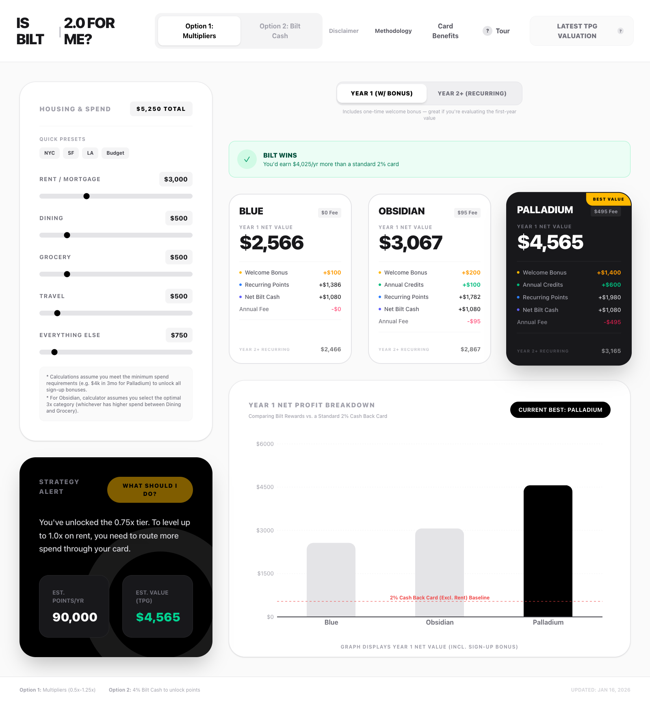

# Is Bilt 2.0 For Me?

> **Should you get the new Bilt Mastercard?** Find out in seconds.

An interactive, open-source calculator that helps you determine if the new Bilt Mastercard (2.0) tiered system is worth it for your specific spending and rent profile.

**[Try it live →](https://is-bilt2-for-me.pages.dev/)**



## The Problem

In January 2026, Bilt Rewards updated their program to "Bilt 2.0", introducing significant complexity with two distinct earning paths:

1. **Spend-based Multipliers:** Spending enough on the card to unlock rent point earning rates (0.5x - 1.25x)
2. **Bilt Cash Unlock:** Using earned "Bilt Cash" (4% on non-rent spend) to "buy" rent points

The math is no longer straightforward. This calculator does the hard work for you.

## Features

- **Real-time Calculations** — Instantly see your net value as you adjust rent, dining, grocery, travel, and other spend
- **All Three Tiers Compared** — Blue ($0), Obsidian ($95), and Palladium ($495) side-by-side
- **Year 1 vs Year 2+ Toggle** — See first-year value (with welcome bonus) vs ongoing annual value
- **Quick City Presets** — Pre-filled spending profiles for NYC, SF, LA, and Budget lifestyles
- **"Bilt Worth It?" Indicator** — Instant comparison against a standard 2% cash back card
- **Strategy Recommendations** — Personalized advice based on your spend profile
- **Interactive Charts** — Visual breakdown of net profit by card tier
- **Mobile Responsive** — Works great on desktop and mobile devices

## Methodology

### Point Valuation
- **Rate:** 2.2 cents per point (CPP)
- **Source:** Based on The Points Guy (TPG) valuation for transferable currencies

### The "Double Dip" Calculation
Under Bilt 2.0, users earn rewards on everyday spend (non-rent) in two ways:
- **Standard Points:** 1x-3x points based on tier and category
- **Bilt Cash:** An additional 4% back in Bilt Cash on that same spend

**Net Value Formula:** `(Points × $0.022) + (Bilt Cash Profit) + (Credits) - (Annual Fee)`

### Obsidian 3x Category Logic
For the Obsidian card, you can choose 3x on EITHER dining OR grocery (not both). The calculator automatically selects the optimal category based on your higher spend, with a $25k annual cap on grocery bonus earnings.

### The 2% Baseline
We compare Bilt against a standard 2% cash back card, assuming you do **NOT** pay rent with the comparison card (since paying rent with a standard card usually incurs a ~3% transaction fee). Bilt's unique value is fee-free rent payments.

## Tech Stack

- [React 19](https://react.dev/) + [TypeScript](https://www.typescriptlang.org/)
- [Vite 6](https://vitejs.dev/) for blazing fast builds
- [Tailwind CSS v4](https://tailwindcss.com/) for styling
- [Recharts](https://recharts.org/) for interactive charts
- Deployed on [Cloudflare Pages](https://pages.cloudflare.com/)

## Local Development

```bash
# Install dependencies
npm install

# Start development server
npm run dev

# Build for production
npm run build
```

## Disclaimer

**This project is a free educational tool and is NOT affiliated with, endorsed by, or connected to:**
- Bilt Rewards
- Wells Fargo
- Mastercard
- The Points Guy (TPG)

All valuations are estimates based on publicly available information. Financial decisions are your own responsibility.

## License

Distributed under the MIT License.
